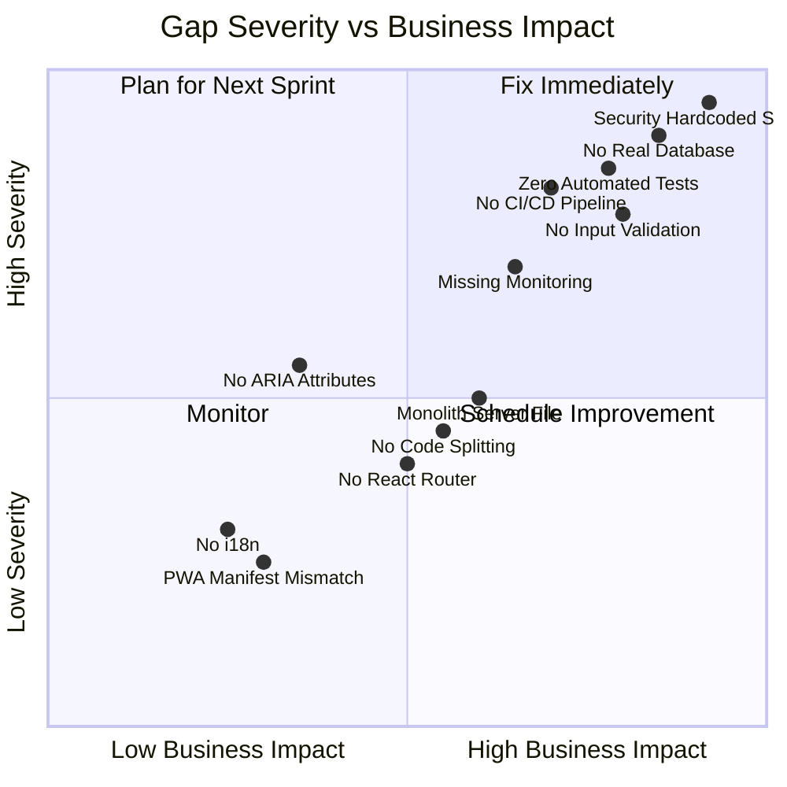
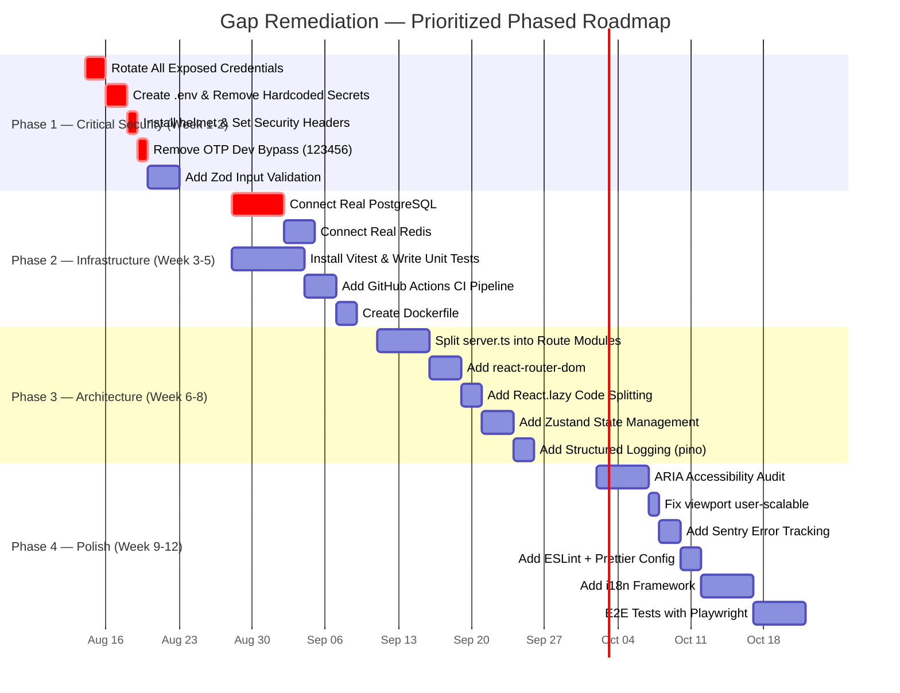
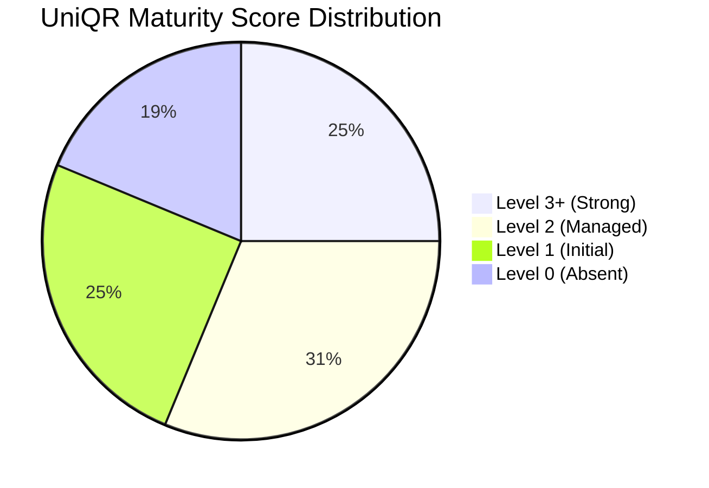
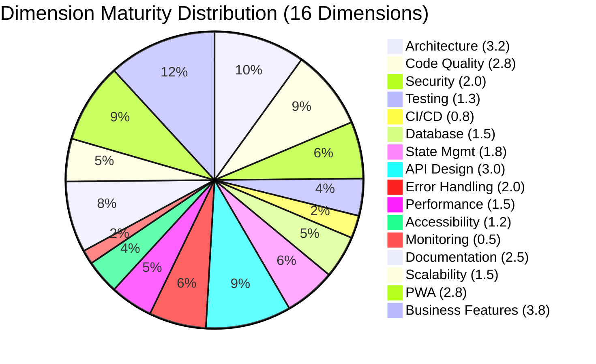
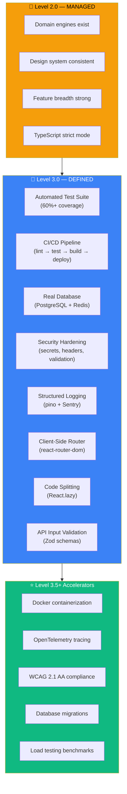

# UniQR — Living Product Identity Platform
## Gap Analysis & Maturity Assessment Report

> [!NOTE]
> This report is generated from a full static analysis of every source file in the UniQR codebase. All findings reference specific files, line numbers, and code patterns. No assumptions are made.

---

# Part I — Gap Analysis

## Executive Summary

The UniQR platform demonstrates **strong domain modeling and feature breadth** — 30+ REST endpoints, 7 domain engines, 28 frontend components, and sophisticated features like SHA-256 tamper-evident ledgers, AI predictive maintenance, and persona-aware responses. However, several **critical infrastructure gaps** exist in security, testing, database architecture, and DevOps that must be addressed before enterprise production readiness.

---

## Gap Heatmap



---

## Gap 1 — SECURITY: Hardcoded Secrets in Source Code

| Attribute | Detail |
|-----------|--------|
| **Severity** | 🔴 **CRITICAL** |
| **Category** | Security |
| **Files** | [server.ts L1056](file:///d:/UniQR/backend/src/server.ts#L1056), [L1095](file:///d:/UniQR/backend/src/server.ts#L1095), [L1171-1172](file:///d:/UniQR/backend/src/server.ts#L1171-L1172) |

**Current State (Evidence):**

```typescript
// server.ts:1056 — MSG91 API key hardcoded in source
const msg91AuthKey = process.env.MSG91_AUTH_KEY || '559789TIkWXRukUxN6a7db525P1';

// server.ts:1095 — SMTP password hardcoded in source
const smtpPass = process.env.SMTP_PASS || 'Bhramit@143';

// server.ts:1171-1172 — Razorpay secret key hardcoded in source
const RAZORPAY_KEY_ID = process.env.RAZORPAY_KEY_ID || 'rzp_test_TPCo3jpV7G3Kwq';
const RAZORPAY_KEY_SECRET = process.env.RAZORPAY_KEY_SECRET || 'iv7q47sJfH8KKEZGSZ3mtaP4';
```

**Expected State:** All secrets must be loaded exclusively from environment variables, `.env` files (git-ignored), or a secrets manager. No fallback values containing real credentials should exist in source code.

**Remediation:**
1. Create `.env` file with all secrets, add `.env` to `.gitignore`
2. Remove all hardcoded fallback values from server.ts
3. Fail fast on startup if required env vars are missing
4. Rotate all exposed credentials immediately (MSG91, SMTP, Razorpay)
5. Add `dotenv` package or use native Node.js `--env-file` flag

---

## Gap 2 — SECURITY: No Security HTTP Headers

| Attribute | Detail |
|-----------|--------|
| **Severity** | 🔴 **CRITICAL** |
| **Category** | Security |
| **Files** | [server.ts L20-28](file:///d:/UniQR/backend/src/server.ts#L20-L28) |

**Current State:** The server uses `cors` middleware only. No `helmet`, no CSP headers, no `X-Frame-Options`, no `X-Content-Type-Options`, no `Strict-Transport-Security` headers are set.

**Expected State:** Enterprise production APIs must set security headers to prevent XSS, clickjacking, MIME sniffing, and protocol downgrade attacks.

**Remediation:**
```bash
npm install helmet
```
```typescript
import helmet from 'helmet';
app.use(helmet());
app.use(helmet.contentSecurityPolicy({ /* CSP rules */ }));
app.use(helmet.hsts({ maxAge: 31536000, includeSubDomains: true }));
```

---

## Gap 3 — SECURITY: No Request Input Validation/Sanitization

| Attribute | Detail |
|-----------|--------|
| **Severity** | 🔴 **HIGH** |
| **Category** | Security |
| **Files** | All POST route handlers in [server.ts](file:///d:/UniQR/backend/src/server.ts) |

**Current State:** No input validation library (Joi, Zod, class-validator) is used anywhere. Request bodies are consumed directly from `req.body` with only basic null-checks. No sanitization against SQL injection, XSS, or prototype pollution.

```typescript
// server.ts:651 — Direct body consumption, no schema validation
app.post('/api/v1/products', (req: Request, res: Response) => {
  const product: Product = req.body; // ← No validation
  if (!product || !product.uniqrCode) { // ← Only null check
```

**Expected State:** All API inputs must be validated against a schema before processing. Use `zod` for TypeScript-native schema validation.

**Remediation:**
```bash
npm install zod
```
Define schemas for every endpoint input, validate at the route handler entry point.

---

## Gap 4 — DATABASE: In-Memory Stores Masquerading as Real Databases

| Attribute | Detail |
|-----------|--------|
| **Severity** | 🔴 **CRITICAL** |
| **Category** | Database / Persistence |
| **Files** | [postgresClient.ts](file:///d:/UniQR/backend/src/domains/db/postgresClient.ts), [redisClient.ts](file:///d:/UniQR/backend/src/domains/db/redisClient.ts) |

**Current State:** Both `PostgresClient` and `RedisClient` are **in-memory mock implementations** — they use `Map` and `Array` data structures with no actual database connections. The class names are misleading.

```typescript
// postgresClient.ts:38-48 — In-memory arrays, not PostgreSQL
class PostgresClient {
  private sessions: SessionRecord[] = [];
  private users: UserRecord[] = [
    { id: 'usr-admin-001', email: 'bhramitp@gmail.com', ... }
  ];
```

```typescript
// redisClient.ts:10-12 — JavaScript Map, not Redis
class RedisClient {
  private cache: Map<string, { value: any; expiresAt: number }> = new Map();
  private rateLimitMap: Map<string, number[]> = new Map();
```

The primary data store is a `db.json` flat file ([server.ts L30](file:///d:/UniQR/backend/src/server.ts#L30)) — data is lost on process restart for sessions/users and is non-concurrent for file I/O.

**Expected State:** Production systems require actual PostgreSQL for relational data and Redis for caching/rate-limiting.

**Remediation:**
1. Connect `postgresClient.ts` to a real PostgreSQL instance via `pg` or Prisma ORM
2. Connect `redisClient.ts` to a real Redis instance via `ioredis`
3. Replace `db.json` file I/O with database queries
4. Add connection pooling, retry logic, and health checks

---

## Gap 5 — TESTING: Zero Automated Test Framework

| Attribute | Detail |
|-----------|--------|
| **Severity** | 🔴 **CRITICAL** |
| **Category** | Testing |
| **Files** | [test_runner.ts](file:///d:/UniQR/backend/src/test_runner.ts) |

**Current State:**
- **No test framework** installed (no Jest, Vitest, Mocha, or Cypress in dependencies)
- **No unit tests** exist for any domain engine, service, or component
- **No integration tests** for API endpoints
- The only test file is a **custom ad-hoc E2E runner** (`test_runner.ts`) using raw `http.request()` — it's not integrated with any CI pipeline and has no assertion library
- **Zero frontend tests** — no component tests, no snapshot tests
- No test scripts in `package.json`

**Expected State:**
- Backend: Vitest or Jest with unit tests for all domain engines + supertest for API integration tests
- Frontend: Vitest + React Testing Library for component tests
- E2E: Playwright or Cypress for critical user flows
- Minimum 60% code coverage

**Remediation:**
```bash
# Backend
npm install -D vitest supertest @types/supertest

# Frontend
npm install -D vitest @testing-library/react @testing-library/jest-dom jsdom
```

---

## Gap 6 — ARCHITECTURE: 1,262-Line Monolith Server File

| Attribute | Detail |
|-----------|--------|
| **Severity** | 🟡 **HIGH** |
| **Category** | Architecture |
| **Files** | [server.ts](file:///d:/UniQR/backend/src/server.ts) (1,262 lines) |

**Current State:** All 30+ route handlers, middleware, business logic, OTP logic, payment processing, and data access are in a single 1,262-line `server.ts` file. This violates single-responsibility principle and makes the codebase hard to test, review, and maintain.

**Expected State:** Routes should be split into modular route files grouped by domain:
```
backend/src/routes/
  ├── auth.routes.ts
  ├── product.routes.ts
  ├── trail.routes.ts
  ├── billing.routes.ts
  ├── analytics.routes.ts
  ├── export.routes.ts
  └── graph.routes.ts
```

**Remediation:** Use Express Router instances, extract each domain's routes into separate files, and mount them in `server.ts`.

---

## Gap 7 — FRONTEND: No Client-Side Router

| Attribute | Detail |
|-----------|--------|
| **Severity** | 🟡 **MEDIUM** |
| **Category** | Frontend Architecture |
| **Files** | [App.tsx](file:///d:/UniQR/src/App.tsx#L38-L120) |

**Current State:** Routing is implemented via manual `useState` + `window.history.pushState()` with a 80-line if/else chain in `App.tsx`. No `react-router-dom` or any routing library is used.

```typescript
// App.tsx:78-119 — Manual pushState routing (80 lines of if/else)
const setCurrentTab = (tab: string) => {
  setCurrentTabState(tab);
  if (tab === 'landing') {
    window.history.pushState({}, '', '/');
  } else if (tab === 'use-cases') {
    window.history.pushState({}, '', '/use-cases');
  } // ... 15+ more conditions
```

**Issues:**
- No route guards / protected routes
- No nested routing / layout routes
- No route-based code splitting (all 28 components loaded upfront)
- Browser back/forward partially working but fragile
- No 404 handling

**Expected State:** Use `react-router-dom` v6+ with `<BrowserRouter>`, `<Routes>`, and `<Route>` for declarative routing, with lazy-loaded route components.

---

## Gap 8 — FRONTEND: No State Management Solution

| Attribute | Detail |
|-----------|--------|
| **Severity** | 🟡 **MEDIUM** |
| **Category** | Frontend Architecture |
| **Files** | [App.tsx](file:///d:/UniQR/src/App.tsx#L130-L160) |

**Current State:** All application state is managed via `useState` hooks in the root `App.tsx` component. State is passed down through 6+ levels of prop drilling. No React Context, Zustand, Redux, or Jotai is used.

```typescript
// App.tsx:131-144 — All state lives in root component
const [products, setProducts] = useState<Product[]>([]);
const [qrRecords, setQrRecords] = useState<QrCodeRecord[]>([]);
const [scans, setScans] = useState<ScanEvent[]>([]);
const [subscription, setSubscription] = useState<any>({});
const [selectedProduct, setSelectedProduct] = useState<Product | null>(null);
const [isProductModalOpen, setIsProductModalOpen] = useState<boolean>(false);
// ... passed as props to 28 child components
```

**Expected State:** Use React Context (minimum) or Zustand/Jotai for global state, with dedicated contexts for auth, products, UI state.

---

## Gap 9 — DEVOPS: No CI/CD Pipeline

| Attribute | Detail |
|-----------|--------|
| **Severity** | 🔴 **HIGH** |
| **Category** | DevOps |
| **Files** | No `.github/workflows/`, no `Jenkinsfile`, no `Dockerfile` |

**Current State:**
- **No CI/CD pipeline** of any kind (GitHub Actions, GitLab CI, Jenkins)
- **No Docker** containerization (`Dockerfile` or `docker-compose.yml` absent)
- **No automated deployment** — manual `tar.gz` distribution files exist ([backend.tar.gz](file:///d:/UniQR/backend.tar.gz), [dist.tar.gz](file:///d:/UniQR/dist.tar.gz)) suggesting manual SCP/SFTP deployment
- **No linting** in CI (ESLint not configured)
- **No build verification** before deploy

**Expected State:** GitHub Actions workflow with: lint → type-check → test → build → deploy stages. Docker for reproducible environments.

---

## Gap 10 — PERFORMANCE: No Code Splitting or Lazy Loading

| Attribute | Detail |
|-----------|--------|
| **Severity** | 🟡 **MEDIUM** |
| **Category** | Performance |
| **Files** | [App.tsx](file:///d:/UniQR/src/App.tsx#L1-L35) |

**Current State:**
- All 28 components are eagerly imported at the top of `App.tsx`
- No `React.lazy()` or dynamic `import()` is used
- No `useMemo` or `useCallback` hooks found anywhere in the codebase
- No virtualization for lists (product list, audit logs)
- The `CreateProductWorkspace.tsx` alone is **60,379 bytes** — loaded even when not visible

**Expected State:** Route-based code splitting with `React.lazy()` and `<Suspense>`, memoization for expensive computations, virtual scrolling for large lists.

---

## Gap 11 — ACCESSIBILITY: Zero ARIA Attributes

| Attribute | Detail |
|-----------|--------|
| **Severity** | 🟡 **MEDIUM** |
| **Category** | Accessibility (WCAG 2.1) |
| **Files** | All `.tsx` component files |

**Current State:**
- **Zero `aria-*` attributes** found across all frontend components
- No `role` attributes on custom interactive elements
- No `aria-label` on icon-only buttons
- No skip navigation links
- `user-scalable=no` in viewport meta tag ([index.html L6](file:///d:/UniQR/index.html#L6)) — **blocks pinch-to-zoom** for vision-impaired users
- Focus ring styling exists in CSS ✅ but no programmatic focus management

**Positives:** Custom focus ring styles do exist in [index.css L24-27](file:///d:/UniQR/src/index.css#L24-L27).

**Expected State:** WCAG 2.1 AA compliance: `aria-label`, `aria-expanded`, `aria-live`, semantic HTML, keyboard navigation, skip-to-content link.

---

## Gap 12 — MONITORING: No Observability Stack

| Attribute | Detail |
|-----------|--------|
| **Severity** | 🟡 **HIGH** |
| **Category** | Monitoring / Observability |
| **Files** | All backend files |

**Current State:**
- **Logging:** Raw `console.log()` only (16 instances found) — no structured logging library (winston, pino)
- **Metrics:** No Prometheus, Datadog, or NewRelic integration
- **Tracing:** No OpenTelemetry or distributed tracing
- **Alerting:** No error alerting (Sentry, PagerDuty)
- **Health endpoint** exists ✅ but returns static data, not actual subsystem health
- **No request logging middleware** (morgan, pino-http)

**Expected State:** Structured JSON logging with pino, error tracking with Sentry, uptime monitoring, request/response logging middleware.

---

## Additional Gaps Summary Table

| # | Gap | Severity | Current State | Expected State |
|---|-----|----------|--------------|----------------|
| 13 | No `.env` file | 🔴 CRITICAL | Secrets in source | `.env` + `.env.example` |
| 14 | No ESLint config | 🟡 MEDIUM | No linting rules | ESLint + Prettier config |
| 15 | No i18n support | 🟢 LOW | English hardcoded throughout | react-i18next for multi-language |
| 16 | PWA manifest color mismatch | 🟢 LOW | `theme_color: #006ec7` in [manifest.json](file:///d:/UniQR/public/manifest.json) vs `#1D4533` actual theme | Align to `#1D4533` |
| 17 | OTP dev bypass | 🟡 HIGH | Code `123456` always accepted ([server.ts L1149](file:///d:/UniQR/backend/src/server.ts#L1149)) | Remove in production |
| 18 | No request rate limiting middleware | 🟡 HIGH | Rate limiting only on `/resolve/:qr` | Global rate limiter via express-rate-limit |
| 19 | No CORS per-route config | 🟢 LOW | Blanket CORS for all origins | Restrict to specific origins per env |
| 20 | No database migrations | 🔴 HIGH | No migration system | Prisma Migrate or Knex migrations |
| 21 | Monolithic `CreateProductWorkspace.tsx` (60KB) | 🟡 MEDIUM | Single 60KB component file | Split into sub-components |
| 22 | No API versioning strategy | 🟢 LOW | `/api/v1/` prefix exists ✅ | Document deprecation policy |

---

## Gap Remediation Roadmap



---

---

# Part II — Maturity Assessment

## Assessment Framework

This assessment uses a **CMMI-inspired 5-level maturity model** adapted for modern web application engineering:

| Level | Name | Description |
|-------|------|-------------|
| **1** | **Initial** | Ad-hoc processes, unpredictable outcomes, hero-driven development |
| **2** | **Managed** | Basic project management, repeatable patterns exist but inconsistent |
| **3** | **Defined** | Standardized processes, documentation, consistent patterns across team |
| **4** | **Measured** | Quantitative quality metrics, automated quality gates, data-driven |
| **5** | **Optimizing** | Continuous improvement, self-healing systems, automated optimization |

---

## Dimension Scores



---

### Detailed Scoring — 16 Dimensions

| # | Dimension | Score | Level | Justification |
|---|-----------|-------|-------|---------------|
| 1 | **Architecture & Modularity** | 3.2 / 5 | Defined | Domain-Driven Design structure exists (7 domain engines in `domains/` directory). Clean separation between entities, events, auth, QR, AI, graph, and DB layers. However, `server.ts` monolith (1,262 lines) undermines this. Frontend has 18 component directories — well organized. |
| 2 | **Code Quality & TypeScript** | 2.8 / 5 | Managed | `strict: true` enabled in both tsconfigs ✅. Strong typing in interfaces (18+ types in [types/index.ts](file:///d:/UniQR/src/types/index.ts)). However, `any` type used in multiple places, no ESLint, no Prettier, some `@ts-ignore` comments. |
| 3 | **Security Posture** | 2.0 / 5 | Initial | HttpOnly cookies ✅, SHA-256 session hashing ✅, session rotation ✅, CORS configured ✅. But: hardcoded secrets 🔴, no helmet 🔴, no input validation 🔴, OTP bypass 🔴, no CSRF protection. |
| 4 | **Testing & Quality Assurance** | 1.3 / 5 | Initial | One ad-hoc E2E test runner exists (12 test cases). No test framework installed. Zero unit tests. Zero component tests. Zero coverage measurement. No test scripts in package.json. |
| 5 | **CI/CD & DevOps** | 0.8 / 5 | Absent | No CI/CD pipeline. No Docker. No automated deployment. Manual tar.gz distribution. nginx config exists ✅ but no infrastructure-as-code. |
| 6 | **Database & Persistence** | 1.5 / 5 | Initial | Well-designed interface abstractions (PostgresClient, RedisClient) ✅. But implementations are pure in-memory mocks. Primary store is `db.json` flat file. No migrations, no connection pooling, no backup strategy. |
| 7 | **State Management** | 1.8 / 5 | Initial | localStorage-based persistence service ✅ ([storage.ts](file:///d:/UniQR/src/services/storage.ts) — 315 lines, well-structured). But no global state solution — all state via `useState` in root component with prop drilling. No React Context for auth/theme. |
| 8 | **API Design** | 3.0 / 5 | Defined | RESTful conventions followed ✅, OpenAPI 3.0 spec endpoint exists ✅ ([server.ts L229-276](file:///d:/UniQR/backend/src/server.ts#L229-L276)), JSON Schema endpoint ✅, versioned URLs (`/api/v1/`) ✅, rate limiting headers ✅. Missing: response pagination, field filtering, HATEOAS links. |
| 9 | **Error Handling** | 2.0 / 5 | Initial | React ErrorBoundary exists at root level ✅ ([ErrorBoundary.tsx](file:///d:/UniQR/src/components/common/ErrorBoundary.tsx)). Backend has basic try-catch in some routes. But: silent `.catch(() => {})` in frontend API calls, no global Express error handler, no structured error response format. |
| 10 | **Performance Optimization** | 1.5 / 5 | Initial | Vite build system ✅, font preconnect ✅ ([index.html L10-11](file:///d:/UniQR/index.html#L10-L11)). But: no code splitting, no lazy loading, no `useMemo`/`useCallback`, no virtual scrolling, 60KB single component file loaded eagerly. |
| 11 | **Accessibility (A11y)** | 1.2 / 5 | Initial | Focus-visible ring styles ✅, semantic heading hierarchy ✅. But: zero ARIA attributes, `user-scalable=no` blocks zoom, no skip-nav, no keyboard navigation testing, no screen reader support. |
| 12 | **Monitoring & Observability** | 0.5 / 5 | Absent | Health endpoint exists ✅ (static response). But: `console.log` only logging, no structured logger, no metrics, no tracing, no error tracking service, no uptime monitoring. |
| 13 | **Documentation** | 2.5 / 5 | Managed | Multiple .md files exist (core.md, design.md, deploy.md, billsoft_integration.md). OpenAPI endpoint ✅. But: no JSDoc/TSDoc in code, no README.md at project root, no API usage examples, no architecture decision records (ADRs). |
| 14 | **Scalability** | 1.5 / 5 | Initial | Event-driven architecture pattern (EventBus) ✅, rate limiting ✅. But: single-process Node.js, no clustering, no load balancing config, in-memory state prevents horizontal scaling, file-based DB locks to single instance. |
| 15 | **PWA & Mobile** | 2.8 / 5 | Managed | Service worker with cache strategies ✅ ([sw.js](file:///d:/UniQR/public/sw.js)), manifest.json ✅, PwaBanner component ✅, responsive Tailwind classes ✅, BottomNav for mobile ✅. Issues: manifest colors mismatch, minimal cache-first strategy, no offline page. |
| 16 | **Business Feature Completeness** | 3.8 / 5 | Defined | Impressive breadth: Product CRUD, QR Studio, Product Passport, Tamper-Evident Ledger, AI Predictive Maintenance, Graph Intelligence, Camera Scanner, Analytics, Billing/Razorpay, Multi-channel OTP, BillSoft Integration, DXF/PDF Export, Bulk Import. Very few platforms at this stage have this range. |

---

## Overall Maturity Score

```mermaid
gauge
    title Overall Platform Maturity
    value 2.0
    min 0
    max 5
    segment 0 1 "#DC2626"
    segment 1 2 "#F59E0B"
    segment 2 3 "#3B82F6"
    segment 3 4 "#10B981"
    segment 4 5 "#6366F1"
```

### **Overall: Level 2.0 — MANAGED** (Transitioning from Level 1 to Level 2)

The platform has exited the purely ad-hoc "Initial" stage — it has repeatable patterns, a clear domain architecture, and consistent design system. However, it lacks the standardized processes, automated quality gates, and production-grade infrastructure required for Level 3 (Defined).

---

## Maturity Radar Chart



---

## Recognized Strengths

> [!TIP]
> These are areas where UniQR exceeds expectations for its current maturity level.

| Strength | Evidence |
|----------|----------|
| **Domain-Driven Design** | 7 distinct domain engines (AI, Auth, QR Lifecycle, QR Access Policy, Entity, Relationship, EventBus) with clean interfaces |
| **Design System Consistency** | Strict 4-color botanical theme (Forest/Linen/Peach/Espresso) consistently applied across all 28 components via Tailwind config |
| **QR Rendering Engine** | Custom canvas-based QR renderer with 7 style variants, gradient support, finder pattern customization — [qrEngine.ts](file:///d:/UniQR/src/services/qrEngine.ts) |
| **Tamper-Evident Ledger** | SHA-256 hash-chained event trail with integrity verification — a blockchain-lite pattern implemented correctly |
| **AI Decision Engine** | Predictive maintenance scoring, impossible-travel fraud detection, persona-aware dynamic responses — sophisticated for any stage |
| **Export Capabilities** | Multi-format export: PNG/SVG/PDF sticker sheets, DXF for laser cutting — industrial-grade output |
| **Feature Breadth** | 30+ endpoints, 28 components, 6 subscription tiers, multi-channel OTP, payment gateway — remarkable scope |
| **Type System** | 18+ well-defined TypeScript interfaces covering the full domain model with union types and generics |
| **PWA Foundation** | Service worker, manifest, PwaBanner component, network-first HTML strategy |

---

## Path to Level 3 (Defined) — Required Actions



---

## Maturity Growth Projection

| Milestone | Target Date | Actions | Projected Score |
|-----------|-------------|---------|-----------------|
| **M1: Security Foundation** | Week 2 | Rotate secrets, .env, helmet, Zod validation | 2.4 |
| **M2: Real Infrastructure** | Week 5 | PostgreSQL, Redis, Vitest, GitHub Actions | 2.8 |
| **M3: Architecture Polish** | Week 8 | Router, code splitting, route modules, Zustand | 3.2 |
| **M4: Enterprise Ready** | Week 12 | Monitoring, a11y, Docker, E2E tests, i18n | 3.5 |

---

## Risk Register

| Risk | Probability | Impact | Mitigation |
|------|-------------|--------|------------|
| **Credential breach** (hardcoded secrets in repo) | HIGH | CRITICAL | Immediate rotation + .env migration |
| **Data loss on server restart** (in-memory DB) | HIGH | HIGH | Migrate to PostgreSQL |
| **Regression bugs shipped** (no tests) | HIGH | HIGH | Add test suite before further features |
| **Manual deployment failure** (no CI/CD) | MEDIUM | HIGH | GitHub Actions pipeline |
| **Performance degradation** (no code splitting) | MEDIUM | MEDIUM | React.lazy + route-based splitting |
| **Accessibility lawsuit risk** (no ARIA) | LOW | HIGH | WCAG 2.1 AA audit |

---

> [!IMPORTANT]
> **Top 3 Immediate Priorities:**
> 1. 🔴 **Rotate all exposed credentials** and move to `.env` — this is a live security vulnerability
> 2. 🔴 **Connect real PostgreSQL and Redis** — in-memory stores will lose all session and user data on restart
> 3. 🔴 **Install a test framework** and add unit tests for the 7 domain engines — current codebase has zero guardrails against regressions
