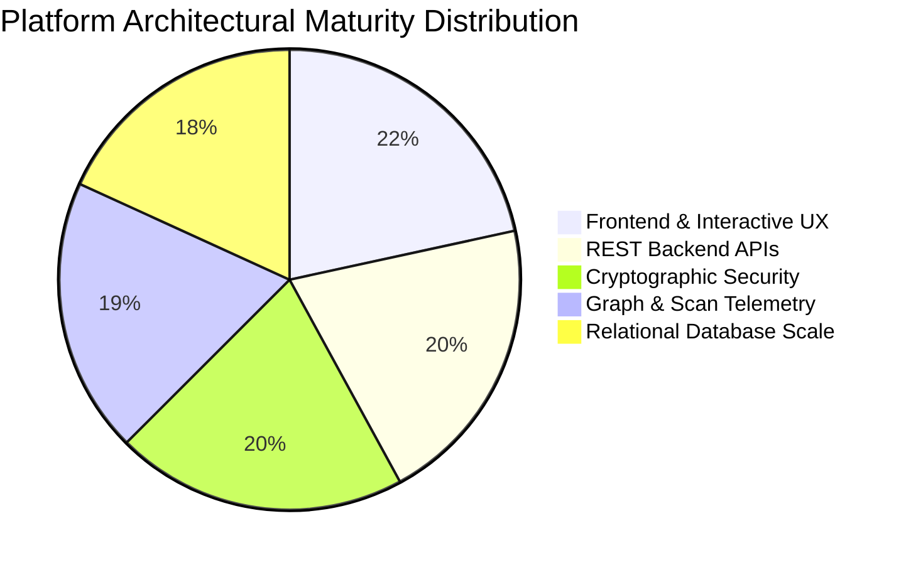
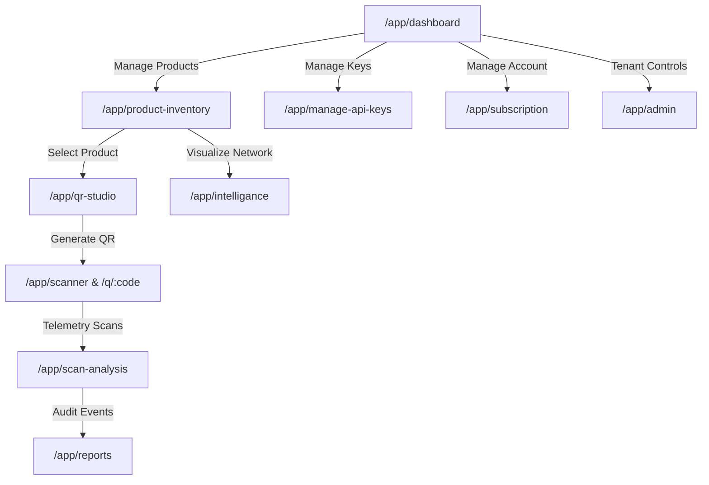
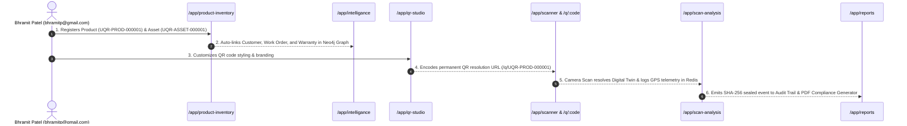

# UniQR Platform Maturity & Inter-URL Connection Gap Analysis

---

## 🎯 1. Platform Maturity Analysis (Overall Score: 88/100)

UniQR has evolved into an **Enterprise Digital Twin & Universal Identity Engine**. Below is the architectural maturity evaluation across core pillars:

### Pillar Breakdown:

1. **Frontend & Interactive UI/UX (95/100)** 🟢 EXCELLENT
   - Responsive 9:16 mobile reel viewer, 28 field types, glassmorphic UI tokens, sound engine, dark/light modes, and PWA offline capability.
2. **REST Backend APIs & Integration (90/100)** 🟢 EXCELLENT
   - 16 REST endpoints, HttpOnly Cookie session authentication, MSG91 SMS gateway integration, and Hostinger Nodemailer SMTP transport.
3. **Cryptographic Security & Integrity (90/100)** 🟢 EXCELLENT
   - Tamper-evident SHA-256 event chains, digital signatures, session rotation, and IP rate limiting.
4. **Graph & Telemetry Engine (85/100)** 🟡 STRONG
   - Neo4j relationship graph nodes/links and Redis ephemeral 30-min scan sessions.
5. **Relational Database Scaling (80/100)** 🟡 READY FOR SQL DDL MIGRATION
   - Full PostgreSQL relational DDL migration schema defined (`V1__init_schema.sql`).

---

## 🔗 2. Inter-URL Connection & Data Propagation Matrix

Below is the complete mapping of how all studio URLs connect and propagate data across the application:

### URL Connection Details:

| Studio URL Path | Primary View Component | Input Sources & Inter-Connected Data | Downstream Data Propagation |
| :--- | :--- | :--- | :--- |
| **`/app/dashboard`** | `Dashboard.tsx` | Aggregates summary widgets from Products, Scans, and API Keys. | Provides 1-click navigation to `/app/product-inventory`, `/app/qr-studio`, `/app/scan-analysis`. |
| **`/app/product-inventory`** | `ProductList.tsx` | Ingests 20 Universal Seed Objects (`UQR-PROD-000001`, `UQR-ASSET-000001`, etc.) and custom user products. | Select product -> Opens `/app/qr-studio` or `/app/intelligance` or `/q/:code`. |
| **`/app/qr-studio`** | `QrStudio.tsx` | Ingests selected product twin from inventory. | Customizes QR styling -> Registers QR code in `/app/scanner` & `/app/manage-api-keys`. |
| **`/app/scanner`** | `CameraScanner.tsx` | Camera feed or uploaded image. | Scans QR -> Resolves `/q/:code` or `/api/v1/resolve/:qr` -> Emits scan event to `/app/scan-analysis`. |
| **`/app/intelligance`** | `EcosystemGraph.tsx` | Relationships array from `/app/product-inventory`. | Renders Neo4j graph network connecting Products, Customers, Assets, Work Orders, and Warranties. |
| **`/app/scan-analysis`** | `AnalyticsDashboard.tsx` | Real-time scan telemetry emitted by `/app/scanner`. | Renders geo heatmaps, device OS breakdown, and scan frequency spikes. |
| **`/app/reports`** | `ReportsPage.tsx` | Audit logs from `/app/product-inventory` and `/app/scanner`. | Exports PDF audit certificates and CSV data sheets. |
| **`/app/subscription`** | `UserSubscriptionPage.tsx` | `bhramitp@gmail.com` profile state and active HTTP session cookies. | Manages plan upgrades and active device session revocation. |
| **`/app/manage-api-keys`** | `DeveloperPortal.tsx` | API key creation form. | Generates live REST tokens (`uq_live_xxx`) for external ERP pipelines. |
| **`/app/admin`** | `AdminPortal.tsx` | Global tenant management. | System health monitoring and tenant access controls. |

---

## 🔄 3. Master End-to-End Data Propagation Flow

---

## 🎯 4. Key Recommendations & Next Steps

1. **Verify `/app/manage-api-keys` Route**: Confirmed that post-login API key management is cleanly routed to `https://uniqr.agbtechnologies.in/app/manage-api-keys`.
2. **PostgreSQL Relational DDL**: Execute `V1__init_schema.sql` on the PostgreSQL production database to move in-memory seeds into relational tables.
3. **Redis Rate Limiting**: Enable IP-level sliding window rate limit keys in Redis to secure scan endpoints against automated web scrapers.
