# UniQR — Living Product Identity Platform
## Comprehensive Software Engineering Visual Diagrams

> [!NOTE]
> This report contains **8 categories** of visual software diagrams derived from a full static analysis of the UniQR codebase. Every diagram is generated directly from the actual source code — no assumptions, no placeholders.

---

## Table of Contents

| # | Diagram Category | Description |
|---|---|---|
| 1 | [Flowcharts](#1-flowcharts) | Business process & decision logic |
| 2 | [Use Case Diagrams](#2-use-case-diagrams) | Actor-system interaction map |
| 3 | [Data Flow Diagrams (DFD)](#3-data-flow-diagrams-dfd) | Data movement & transformation |
| 4 | [Class Diagrams](#4-class-diagrams-uml) | Static structure, objects & attributes |
| 5 | [Sequence Diagrams](#5-sequence-diagrams) | Time-based message flow |
| 6 | [Entity-Relationship Diagrams (ERD)](#6-entity-relationship-diagrams-erd) | Database tables, fields & connections |
| 7 | [Component & Deployment Diagrams](#7-component--deployment-diagrams) | Software modules & server topology |
| 8 | [Agile / Iterative Spirals](#8-agile--iterative-spirals) | Feedback loops & delivery cycles |

---

## 1. Flowcharts

### 1.1 — QR Code Scan Resolution Flowchart

This flowchart captures the complete decision logic when any QR code is scanned via the public gateway endpoint `GET /api/v1/resolve/:qr` in [server.ts](file:///d:/UniQR/backend/src/server.ts#L296-L363).

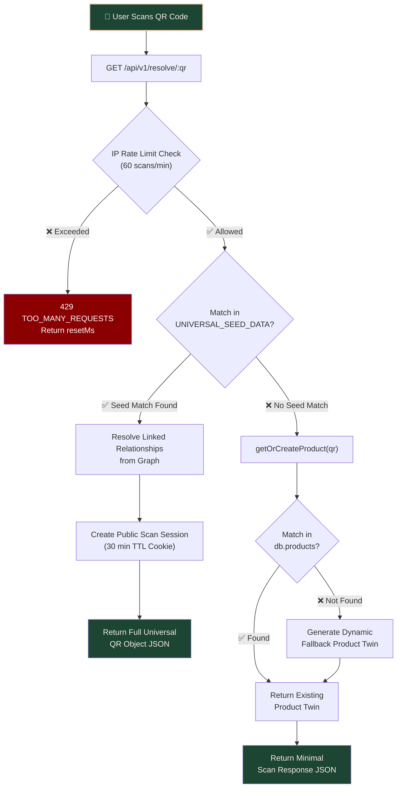
```mermaid
flowchart TD
    A["📱 User Scans QR Code"] --> B["GET /api/v1/resolve/:qr"]
    B --> C{"IP Rate Limit Check<br/>(60 scans/min)"}
    C -- "❌ Exceeded" --> D["429 TOO_MANY_REQUESTS<br/>Return resetMs"]
    C -- "✅ Allowed" --> E{"Match in<br/>UNIVERSAL_SEED_DATA?"}
    E -- "✅ Seed Match Found" --> F["Resolve Linked Relationships<br/>from Graph"]
    F --> G["Create Public Scan Session<br/>(30 min TTL Cookie)"]
    G --> H["Return Full Universal<br/>QR Object JSON"]
    E -- "❌ No Seed Match" --> I["getOrCreateProduct(qr)"]
    I --> J{"Match in<br/>db.products?"}
    J -- "✅ Found" --> K["Return Existing<br/>Product Twin"]
    J -- "❌ Not Found" --> L["Generate Dynamic<br/>Fallback Product Twin"]
    L --> K
    K --> M["Return Minimal<br/>Scan Response JSON"]

    style A fill:#1D4533,color:#F7EAE0,stroke:#F9D2BA,stroke-width:2px
    style D fill:#8B0000,color:#fff
    style H fill:#1D4533,color:#F7EAE0
    style M fill:#1D4533,color:#F7EAE0
```

---

### 1.2 — OTP Authentication Flow

Full authentication lifecycle using Email (Hostinger SMTP) and SMS (MSG91) channels, as implemented in [server.ts](file:///d:/UniQR/backend/src/server.ts#L1037-L1168).

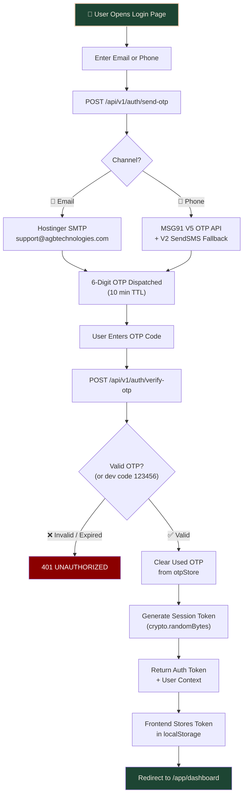
```mermaid
flowchart TD
    Start["🔐 User Opens Login Page"] --> A["Enter Email or Phone"]
    A --> B["POST /api/v1/auth/send-otp"]
    B --> C{"Channel?"}
    C -- "📧 Email" --> D["Hostinger SMTP<br/>support@agbtechnologies.com"]
    C -- "📱 Phone" --> E["MSG91 V5 OTP API<br/>+ V2 SendSMS Fallback"]
    D --> F["6-Digit OTP Dispatched<br/>(10 min TTL)"]
    E --> F
    F --> G["User Enters OTP Code"]
    G --> H["POST /api/v1/auth/verify-otp"]
    H --> I{"Valid OTP?<br/>(or dev code 123456)"}
    I -- "❌ Invalid / Expired" --> J["401 UNAUTHORIZED"]
    I -- "✅ Valid" --> K["Clear Used OTP<br/>from otpStore"]
    K --> L["Generate Session Token<br/>(crypto.randomBytes)"]
    L --> M["Return Auth Token<br/>+ User Context"]
    M --> N["Frontend Stores Token<br/>in localStorage"]
    N --> O["Redirect to /app/dashboard"]

    style Start fill:#1D4533,color:#F7EAE0,stroke:#F9D2BA,stroke-width:2px
    style J fill:#8B0000,color:#fff
    style O fill:#1D4533,color:#F7EAE0
```

---

### 1.3 — Tamper-Evident Trail Event Append Flowchart

Hash-chained ledger append logic from [server.ts](file:///d:/UniQR/backend/src/server.ts#L850-L909) and [trailLedger.ts](file:///d:/UniQR/src/services/trailLedger.ts).

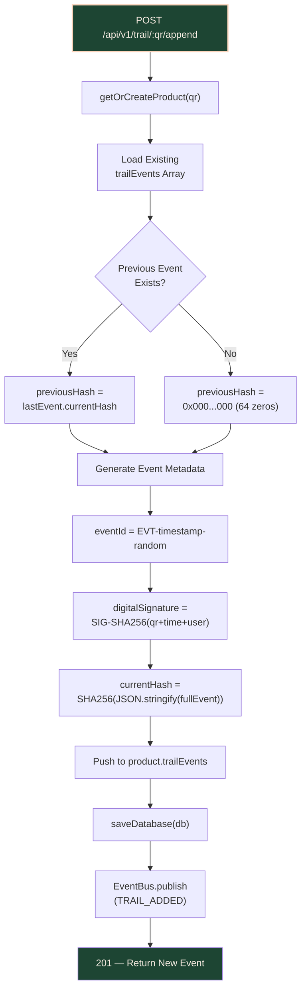
```mermaid
flowchart TD
    A["POST /api/v1/trail/:qr/append"] --> B["getOrCreateProduct(qr)"]
    B --> C["Load Existing<br/>trailEvents Array"]
    C --> D{"Previous Event<br/>Exists?"}
    D -- "Yes" --> E["previousHash =<br/>lastEvent.currentHash"]
    D -- "No" --> F["previousHash =<br/>0x000...000 (64 zeros)"]
    E --> G["Generate Event Metadata"]
    F --> G
    G --> H["eventId = EVT-timestamp-random"]
    H --> I["digitalSignature =<br/>SIG-SHA256(qr+time+user)"]
    I --> J["currentHash =<br/>SHA256(JSON.stringify(fullEvent))"]
    J --> K["Push to product.trailEvents"]
    K --> L["saveDatabase(db)"]
    L --> M["EventBus.publish<br/>(TRAIL_ADDED)"]
    M --> N["201 — Return New Event"]

    style A fill:#1D4533,color:#F7EAE0,stroke:#F9D2BA,stroke-width:2px
    style N fill:#1D4533,color:#F7EAE0
```

---

### 1.4 — Razorpay Payment & Plan Upgrade Flow

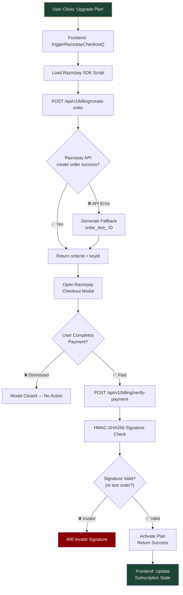
```mermaid
flowchart TD
    A["User Clicks 'Upgrade Plan'"] --> B["Frontend: triggerRazorpayCheckout()"]
    B --> C["Load Razorpay SDK Script"]
    C --> D["POST /api/v1/billing/create-order"]
    D --> E{"Razorpay API<br/>create order success?"}
    E -- "✅ Yes" --> F["Return orderId + keyId"]
    E -- "❌ API Error" --> G["Generate Fallback<br/>order_test_ ID"]
    G --> F
    F --> H["Open Razorpay<br/>Checkout Modal"]
    H --> I{"User Completes<br/>Payment?"}
    I -- "❌ Dismissed" --> J["Modal Closed — No Action"]
    I -- "✅ Paid" --> K["POST /api/v1/billing/verify-payment"]
    K --> L["HMAC-SHA256 Signature Check"]
    L --> M{"Signature Valid?<br/>(or test order?)"}
    M -- "❌ Invalid" --> N["400 Invalid Signature"]
    M -- "✅ Valid" --> O["Activate Plan<br/>Return Success"]
    O --> P["Frontend: Update<br/>Subscription State"]

    style A fill:#1D4533,color:#F7EAE0,stroke:#F9D2BA,stroke-width:2px
    style N fill:#8B0000,color:#fff
    style P fill:#1D4533,color:#F7EAE0
```

---

## 2. Use Case Diagrams

### 2.1 — Complete System Use Case Map

All actors and their interactions extracted from [App.tsx](file:///d:/UniQR/src/App.tsx) route mapping and [server.ts](file:///d:/UniQR/backend/src/server.ts) API endpoints.

```mermaid
flowchart LR
    subgraph Actors
        PUB["👤 Public User<br/>(Anonymous Scanner)"]
        AUTH["🔑 Authenticated User<br/>(Product Owner)"]
        ADMIN["🛡️ Admin / Enterprise"]
        DEV["💻 Developer<br/>(API Consumer)"]
        EXT["🔗 External Systems<br/>(BillSoft / ERP)"]
    end

    subgraph UC_Public["Public Use Cases"]
        UC1["Scan QR Code"]
        UC2["View Product Passport"]
        UC3["Verify Authenticity"]
        UC4["View Landing Page"]
        UC5["View Use Cases / Features"]
        UC6["View Pricing"]
    end

    subgraph UC_Auth["Authenticated Use Cases"]
        UC7["Login via OTP<br/>(Email / SMS)"]
        UC8["Dashboard Overview"]
        UC9["Create / Edit Product"]
        UC10["Bulk CSV Import"]
        UC11["QR Code Studio<br/>(Design & Export)"]
        UC12["Camera Scanner"]
        UC13["View Analytics"]
        UC14["Manage Subscription"]
        UC15["Razorpay Payment"]
        UC16["View Reports"]
        UC17["Manage Active Sessions"]
    end

    subgraph UC_Admin["Admin Use Cases"]
        UC18["Admin Portal"]
        UC19["Manage API Keys"]
        UC20["View Audit Logs"]
        UC21["Account Deactivation"]
        UC22["Bulk Product Delete"]
    end

    subgraph UC_Dev["Developer Use Cases"]
        UC23["OpenAPI 3.0 Spec"]
        UC24["JSON Schema Endpoint"]
        UC25["REST API Integration"]
        UC26["Event Bus History"]
    end

    subgraph UC_AI["AI & Intelligence"]
        UC27["Predictive Maintenance<br/>Risk Scoring"]
        UC28["Fraud Detection<br/>(Impossible Travel)"]
        UC29["Persona-Aware<br/>Dynamic Response"]
        UC30["Ecosystem Intelligence<br/>Graph"]
    end

    PUB --> UC1 & UC2 & UC3 & UC4 & UC5 & UC6
    AUTH --> UC7 & UC8 & UC9 & UC10 & UC11 & UC12 & UC13 & UC14 & UC15 & UC16 & UC17
    ADMIN --> UC18 & UC19 & UC20 & UC21 & UC22
    DEV --> UC23 & UC24 & UC25 & UC26
    EXT --> UC25 & UC30
    AUTH --> UC27 & UC28 & UC29 & UC30
```

---

### 2.2 — QR Lifecycle Use Cases (State Machine)

QR identity lifecycle states from [qrLifecycleEngine.ts](file:///d:/UniQR/backend/src/domains/qr/qrLifecycleEngine.ts).

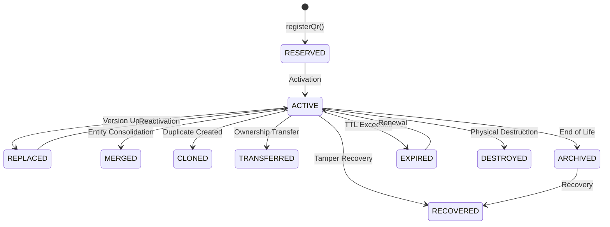
```mermaid
stateDiagram-v2
    [*] --> RESERVED : registerQr()
    RESERVED --> ACTIVE : Activation
    ACTIVE --> REPLACED : Version Upgrade
    ACTIVE --> MERGED : Entity Consolidation
    ACTIVE --> CLONED : Duplicate Created
    ACTIVE --> TRANSFERRED : Ownership Transfer
    ACTIVE --> ARCHIVED : End of Life
    ACTIVE --> EXPIRED : TTL Exceeded
    ACTIVE --> RECOVERED : Tamper Recovery
    ACTIVE --> DESTROYED : Physical Destruction
    REPLACED --> ACTIVE : Reactivation
    ARCHIVED --> RECOVERED : Recovery
    EXPIRED --> ACTIVE : Renewal
```

---

## 3. Data Flow Diagrams (DFD)

### 3.1 — Level 0 Context Diagram

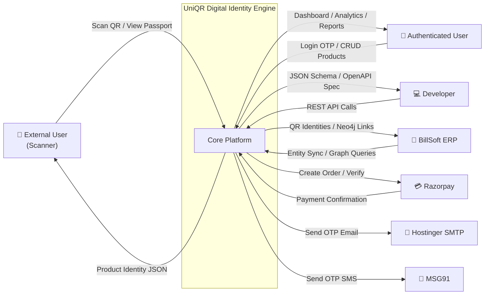
```mermaid
flowchart LR
    ExtUser["👤 External User<br/>(Scanner)"]
    AuthUser["🔑 Authenticated User"]
    Developer["💻 Developer"]
    ExtERP["🏢 BillSoft ERP"]
    Payment["💳 Razorpay"]
    Email["📧 Hostinger SMTP"]
    SMS["📱 MSG91"]

    subgraph UniQR["UniQR Digital Identity Engine"]
        CORE["Core Platform"]
    end

    ExtUser -- "Scan QR / View Passport" --> CORE
    CORE -- "Product Identity JSON" --> ExtUser

    AuthUser -- "Login OTP / CRUD Products" --> CORE
    CORE -- "Dashboard / Analytics / Reports" --> AuthUser

    Developer -- "REST API Calls" --> CORE
    CORE -- "JSON Schema / OpenAPI Spec" --> Developer

    ExtERP -- "Entity Sync / Graph Queries" --> CORE
    CORE -- "QR Identities / Neo4j Links" --> ExtERP

    CORE -- "Create Order / Verify" --> Payment
    Payment -- "Payment Confirmation" --> CORE

    CORE -- "Send OTP Email" --> Email
    CORE -- "Send OTP SMS" --> SMS
```

---

### 3.2 — Level 1 DFD: Internal Data Flows

```mermaid
flowchart TB
    subgraph External
        Scanner["📱 QR Scanner"]
        Browser["🌐 Browser Client"]
        RZP["💳 Razorpay API"]
        SMTP["📧 Hostinger SMTP"]
        MSG91["📱 MSG91 API"]
    end

    subgraph Frontend["React Frontend (Vite)"]
        FE_Router["App.tsx Router"]
        FE_Storage["StorageService<br/>(localStorage)"]
        FE_QrEngine["QrEngine<br/>(Canvas Renderer)"]
        FE_TrailLedger["TrailLedger<br/>(SHA-256 Chain)"]
        FE_Razorpay["Razorpay Client SDK"]
        FE_BillSoft["BillSoftService"]
    end

    subgraph Backend["Express.js Backend (Port 8080)"]
        API_Router["Express Router<br/>(REST Endpoints)"]
        EventBus["EventBus<br/>(EventEmitter)"]
        SessionEngine["SessionEngine"]
        AIEngine["AiDecisionEngine"]
        QRLifecycle["QrLifecycleEngine"]
        AccessPolicy["QrAccessPolicyEngine"]
        EntityEngine["EntityEngine"]
        RelEngine["RelationshipEngine"]
    end

    subgraph DataStores["Data Stores"]
        JSON_DB["db.json<br/>(File System)"]
        Redis["Redis Client<br/>(In-Memory Cache)"]
        Postgres["PostgreSQL Client<br/>(In-Memory Store)"]
        OTPStore["OTP Store<br/>(In-Memory Map)"]
    end

    Scanner -- "GET /api/v1/resolve/:qr" --> API_Router
    Browser -- "HTTP Requests" --> API_Router
    Browser -- "localStorage R/W" --> FE_Storage
    FE_Router --> FE_Storage & FE_QrEngine & FE_TrailLedger & FE_BillSoft

    API_Router --> SessionEngine & AIEngine & QRLifecycle & AccessPolicy & EntityEngine
    API_Router -- "Read/Write" --> JSON_DB
    API_Router -- "OTP CRUD" --> OTPStore
    SessionEngine --> Redis & Postgres
    AccessPolicy --> Redis
    API_Router --> EventBus
    EventBus -- "Broadcast Events" --> AIEngine

    API_Router -- "Create Order / Verify" --> RZP
    API_Router -- "Send Email OTP" --> SMTP
    API_Router -- "Send SMS OTP" --> MSG91

    FE_Razorpay -- "Checkout Flow" --> RZP
```

---

### 3.3 — Scan Analytics Data Flow

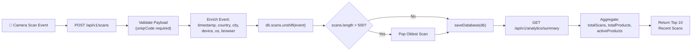
```mermaid
flowchart LR
    A["📱 Camera Scan Event"] --> B["POST /api/v1/scans"]
    B --> C["Validate Payload<br/>(uniqrCode required)"]
    C --> D["Enrich Event:<br/>timestamp, country, city,<br/>device, os, browser"]
    D --> E["db.scans.unshift(event)"]
    E --> F{"scans.length > 500?"}
    F -- "Yes" --> G["Pop Oldest Scan"]
    F -- "No" --> H["saveDatabase(db)"]
    G --> H
    H --> I["GET /api/v1/analytics/summary"]
    I --> J["Aggregate:<br/>totalScans, totalProducts,<br/>activeProducts"]
    J --> K["Return Top 10<br/>Recent Scans"]
```

---

## 4. Class Diagrams (UML)

### 4.1 — Backend Domain Engine Classes

Full class hierarchy extracted from the [domains/](file:///d:/UniQR/backend/src/domains) directory.

```mermaid
classDiagram
    class EventBusService {
        -eventLog: SystemEvent[]
        +publish(event: SystemEvent): void
        +getEventHistory(limit: number): SystemEvent[]
    }

    class SystemEvent {
        +id: string
        +type: EventType
        +entityId: string
        +qrCode: string
        +tenantId: string
        +timestamp: string
        +actor: ActorInfo
        +payload: Record
    }

    class SessionEngine {
        +hashToken(rawToken: string): string
        +generateRawToken(): string
        +createSession(user, ip, ua): Promise~SessionResult~
        +validateSessionToken(rawToken): Promise~SessionContext~
        +rotateSession(currentToken, user, ip, ua): Promise~SessionResult~
    }

    class SessionContext {
        +token: string
        +tokenHash: string
        +sessionRecord: SessionRecord
        +user: UserRecord
    }

    class AiDecisionEngine {
        +calculateFailureRisk(hours, failures, warranty): RiskResult
        +detectFraud(currentScan, prevScan): FraudResult
        +buildPersonaResponse(context, entityData): PersonaResponse
    }

    class PersonaResponse {
        +persona: string
        +headline: string
        +alertLevel: NORMAL|WARNING|CRITICAL
        +predictiveRiskScore: number
        +recommendedAction: string
        +recommendedParts: string[]
        +sections: SectionArray
    }

    class QrLifecycleEngine {
        -qrRecords: Map~string, QrIdentityRecord~
        +registerQr(record): QrIdentityRecord
        +resolveToken(token): QrIdentityRecord
        +transitionState(qrId, newStatus, payload): QrIdentityRecord
    }

    class QrIdentityRecord {
        +qrId: string
        +publicToken: string
        +internalUuid: string
        +status: QrStatus
        +version: number
        +checksum: string
        +ownerTenantId: string
        +targetEntityId: string
    }

    class QrAccessPolicyEngine {
        +evaluateAccess(slug, policy, isAuth, ip, ua): QrPolicyEvaluationResult
    }

    class QrPolicyEvaluationResult {
        +isAccessPermitted: boolean
        +publicSlug: string
        +policy: VisibilityPolicy
        +scanSessionId: string
        +permittedDataFields: string[]
        +restrictedFields: string[]
        +challengeRequired: string
    }

    class EntityEngine {
        -entities: Map~string, EntityRecord~
        +createEntity(entity): EntityRecord
        +getEntity(id): EntityRecord
        +getAllEntities(): EntityRecord[]
        +updateEntityState(id, newState): EntityRecord
    }

    class EntityRecord {
        +id: string
        +entityType: string
        +tenantId: string
        +name: string
        +currentState: string
        +assignedQrCode: string
        +customFields: Record
        +fields: EntityField[]
    }

    class RelationshipEngine {
        -links: GraphRelationship[]
        +addRelationship(link): GraphRelationship
        +getRelationshipsForNode(nodeId): GraphRelationship[]
        +getAllRelationships(): GraphRelationship[]
    }

    class PostgresClient {
        -sessions: SessionRecord[]
        -users: UserRecord[]
        +findUserByEmail(email): Promise~UserRecord~
        +createUser(email, name): Promise~UserRecord~
        +createSession(session): Promise~SessionRecord~
        +findSessionByHash(hash): Promise~SessionRecord~
        +getUserSessions(userId): Promise~SessionRecord[]~
        +revokeSession(id, reason): Promise~boolean~
        +revokeAllOtherSessions(userId, currentId): Promise~number~
    }

    class RedisClient {
        -cache: Map~string, CacheEntry~
        -rateLimitMap: Map~string, number[]~
        +set(key, value, ttl): void
        +get~T~(key): T
        +del(key): void
        +checkRateLimit(ip, limit, window): RateLimitResult
        +createPublicScanSession(slug, ip, ua): string
    }

    SessionEngine --> PostgresClient : uses
    SessionEngine --> RedisClient : uses
    QrAccessPolicyEngine --> RedisClient : uses
    AiDecisionEngine --> PersonaResponse : creates
    QrLifecycleEngine --> QrIdentityRecord : manages
    EventBusService --> SystemEvent : publishes
    SessionEngine --> SessionContext : returns
    EntityEngine --> EntityRecord : stores
```

---

### 4.2 — Frontend Type System

Full TypeScript interfaces from [types/index.ts](file:///d:/UniQR/src/types/index.ts).

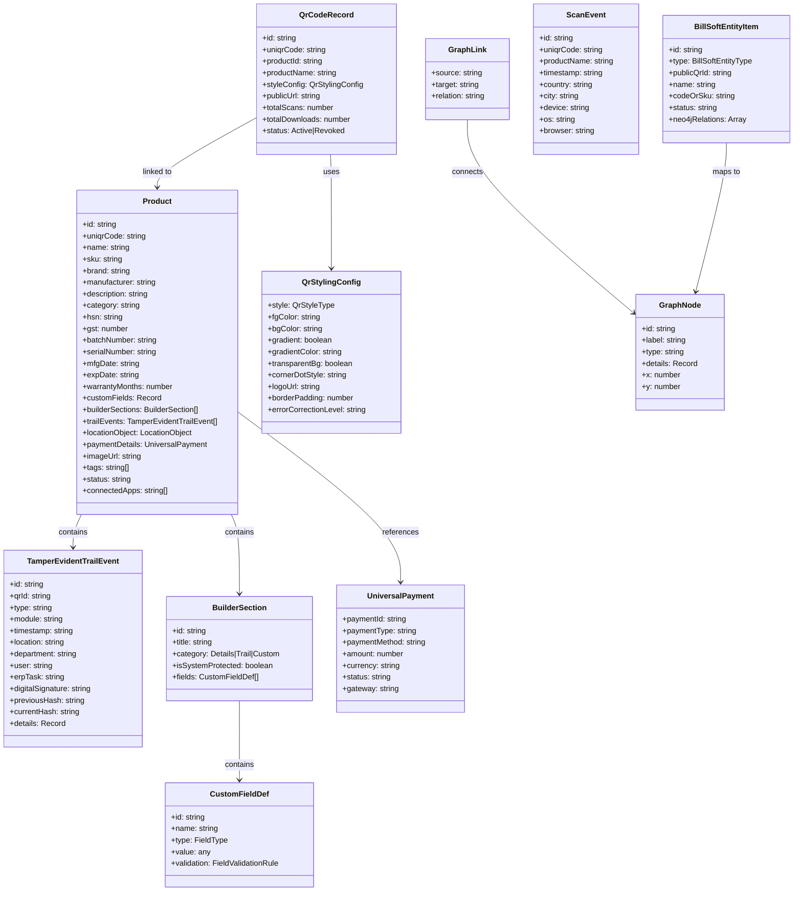
```mermaid
classDiagram
    class Product {
        +id: string
        +uniqrCode: string
        +name: string
        +sku: string
        +brand: string
        +manufacturer: string
        +description: string
        +category: string
        +hsn: string
        +gst: number
        +batchNumber: string
        +serialNumber: string
        +mfgDate: string
        +expDate: string
        +warrantyMonths: number
        +customFields: Record
        +builderSections: BuilderSection[]
        +trailEvents: TamperEvidentTrailEvent[]
        +locationObject: LocationObject
        +paymentDetails: UniversalPayment
        +imageUrl: string
        +tags: string[]
        +status: string
        +connectedApps: string[]
    }

    class QrCodeRecord {
        +id: string
        +uniqrCode: string
        +productId: string
        +productName: string
        +styleConfig: QrStylingConfig
        +publicUrl: string
        +totalScans: number
        +totalDownloads: number
        +status: Active|Revoked
    }

    class QrStylingConfig {
        +style: QrStyleType
        +fgColor: string
        +bgColor: string
        +gradient: boolean
        +gradientColor: string
        +transparentBg: boolean
        +cornerDotStyle: string
        +logoUrl: string
        +borderPadding: number
        +errorCorrectionLevel: string
    }

    class TamperEvidentTrailEvent {
        +id: string
        +qrId: string
        +type: string
        +module: string
        +timestamp: string
        +location: string
        +department: string
        +user: string
        +erpTask: string
        +digitalSignature: string
        +previousHash: string
        +currentHash: string
        +details: Record
    }

    class BuilderSection {
        +id: string
        +title: string
        +category: Details|Trail|Custom
        +isSystemProtected: boolean
        +fields: CustomFieldDef[]
    }

    class CustomFieldDef {
        +id: string
        +name: string
        +type: FieldType
        +value: any
        +validation: FieldValidationRule
    }

    class GraphNode {
        +id: string
        +label: string
        +type: string
        +details: Record
        +x: number
        +y: number
    }

    class GraphLink {
        +source: string
        +target: string
        +relation: string
    }

    class ScanEvent {
        +id: string
        +uniqrCode: string
        +productName: string
        +timestamp: string
        +country: string
        +city: string
        +device: string
        +os: string
        +browser: string
    }

    class UniversalPayment {
        +paymentId: string
        +paymentType: string
        +paymentMethod: string
        +amount: number
        +currency: string
        +status: string
        +gateway: string
    }

    class BillSoftEntityItem {
        +id: string
        +type: BillSoftEntityType
        +publicQrId: string
        +name: string
        +codeOrSku: string
        +status: string
        +neo4jRelations: Array
    }

    Product --> TamperEvidentTrailEvent : contains
    Product --> BuilderSection : contains
    Product --> UniversalPayment : references
    QrCodeRecord --> QrStylingConfig : uses
    QrCodeRecord --> Product : linked to
    BuilderSection --> CustomFieldDef : contains
    GraphLink --> GraphNode : connects
    BillSoftEntityItem --> GraphNode : maps to
```

---

## 5. Sequence Diagrams

### 5.1 — Complete QR Scan → Public Gateway → AI Response Sequence

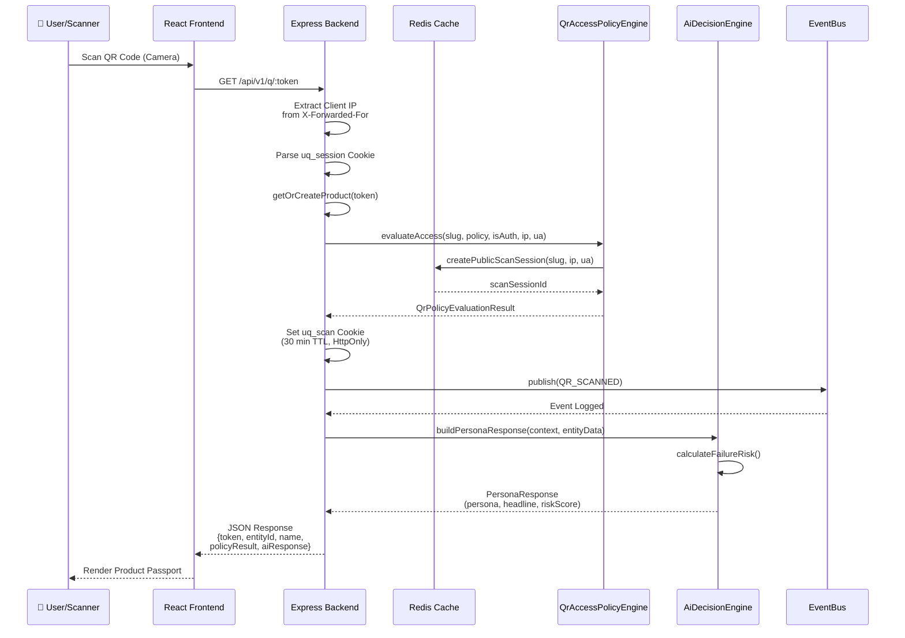
```mermaid
sequenceDiagram
    participant User as 👤 User/Scanner
    participant FE as React Frontend
    participant API as Express Backend
    participant Redis as Redis Cache
    participant Policy as QrAccessPolicyEngine
    participant AI as AiDecisionEngine
    participant EventBus as EventBus

    User->>FE: Scan QR Code (Camera)
    FE->>API: GET /api/v1/q/:token
    
    API->>API: Extract Client IP<br/>from X-Forwarded-For
    API->>API: Parse uq_session Cookie
    API->>API: getOrCreateProduct(token)
    
    API->>Policy: evaluateAccess(slug, policy, isAuth, ip, ua)
    Policy->>Redis: createPublicScanSession(slug, ip, ua)
    Redis-->>Policy: scanSessionId
    Policy-->>API: QrPolicyEvaluationResult

    API->>API: Set uq_scan Cookie<br/>(30 min TTL, HttpOnly)
    
    API->>EventBus: publish(QR_SCANNED)
    EventBus-->>API: Event Logged
    
    API->>AI: buildPersonaResponse(context, entityData)
    AI->>AI: calculateFailureRisk()
    AI-->>API: PersonaResponse<br/>(persona, headline, riskScore)
    
    API-->>FE: JSON Response<br/>{token, entityId, name,<br/>policyResult, aiResponse}
    FE-->>User: Render Product Passport
```

---

### 5.2 — HttpOnly Cookie Session Login Sequence

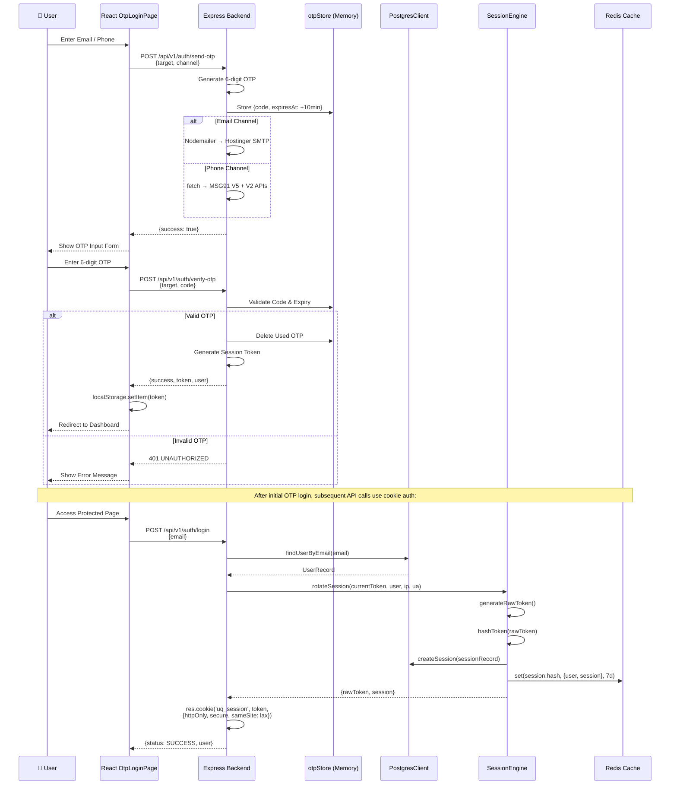
```mermaid
sequenceDiagram
    participant User as 👤 User
    participant FE as React OtpLoginPage
    participant API as Express Backend
    participant OTP as otpStore (Memory)
    participant PG as PostgresClient
    participant Session as SessionEngine
    participant Redis as Redis Cache

    User->>FE: Enter Email / Phone
    FE->>API: POST /api/v1/auth/send-otp<br/>{target, channel}
    API->>API: Generate 6-digit OTP
    API->>OTP: Store {code, expiresAt: +10min}
    
    alt Email Channel
        API->>API: Nodemailer → Hostinger SMTP
    else Phone Channel
        API->>API: fetch → MSG91 V5 + V2 APIs
    end
    
    API-->>FE: {success: true}
    FE-->>User: Show OTP Input Form

    User->>FE: Enter 6-digit OTP
    FE->>API: POST /api/v1/auth/verify-otp<br/>{target, code}
    API->>OTP: Validate Code & Expiry
    
    alt Valid OTP
        API->>OTP: Delete Used OTP
        API->>API: Generate Session Token
        API-->>FE: {success, token, user}
        FE->>FE: localStorage.setItem(token)
        FE-->>User: Redirect to Dashboard
    else Invalid OTP
        API-->>FE: 401 UNAUTHORIZED
        FE-->>User: Show Error Message
    end

    Note over User,Redis: After initial OTP login, subsequent API calls use cookie auth:
    
    User->>FE: Access Protected Page
    FE->>API: POST /api/v1/auth/login<br/>{email}
    API->>PG: findUserByEmail(email)
    PG-->>API: UserRecord
    API->>Session: rotateSession(currentToken, user, ip, ua)
    Session->>Session: generateRawToken()
    Session->>Session: hashToken(rawToken)
    Session->>PG: createSession(sessionRecord)
    Session->>Redis: set(session:hash, {user, session}, 7d)
    Session-->>API: {rawToken, session}
    API->>API: res.cookie('uq_session', token,<br/>{httpOnly, secure, sameSite: lax})
    API-->>FE: {status: SUCCESS, user}
```

---

### 5.3 — Razorpay Payment Verification Sequence

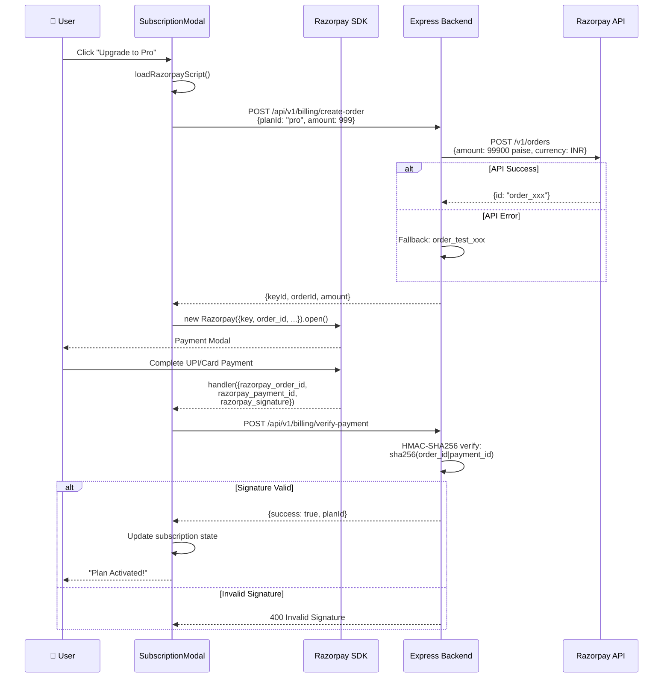
```mermaid
sequenceDiagram
    participant User as 👤 User
    participant FE as SubscriptionModal
    participant RZP_SDK as Razorpay SDK
    participant API as Express Backend
    participant RZP_API as Razorpay API

    User->>FE: Click "Upgrade to Pro"
    FE->>FE: loadRazorpayScript()
    FE->>API: POST /api/v1/billing/create-order<br/>{planId: "pro", amount: 999}
    
    API->>RZP_API: POST /v1/orders<br/>{amount: 99900 paise, currency: INR}
    
    alt API Success
        RZP_API-->>API: {id: "order_xxx"}
    else API Error
        API->>API: Fallback: order_test_xxx
    end
    
    API-->>FE: {keyId, orderId, amount}
    FE->>RZP_SDK: new Razorpay({key, order_id, ...}).open()
    RZP_SDK-->>User: Payment Modal

    User->>RZP_SDK: Complete UPI/Card Payment
    RZP_SDK-->>FE: handler({razorpay_order_id,<br/>razorpay_payment_id,<br/>razorpay_signature})
    
    FE->>API: POST /api/v1/billing/verify-payment
    API->>API: HMAC-SHA256 verify:<br/>sha256(order_id|payment_id)
    
    alt Signature Valid
        API-->>FE: {success: true, planId}
        FE->>FE: Update subscription state
        FE-->>User: "Plan Activated!"
    else Invalid Signature
        API-->>FE: 400 Invalid Signature
    end
```

---

### 5.4 — Trail Event Append & Integrity Verification

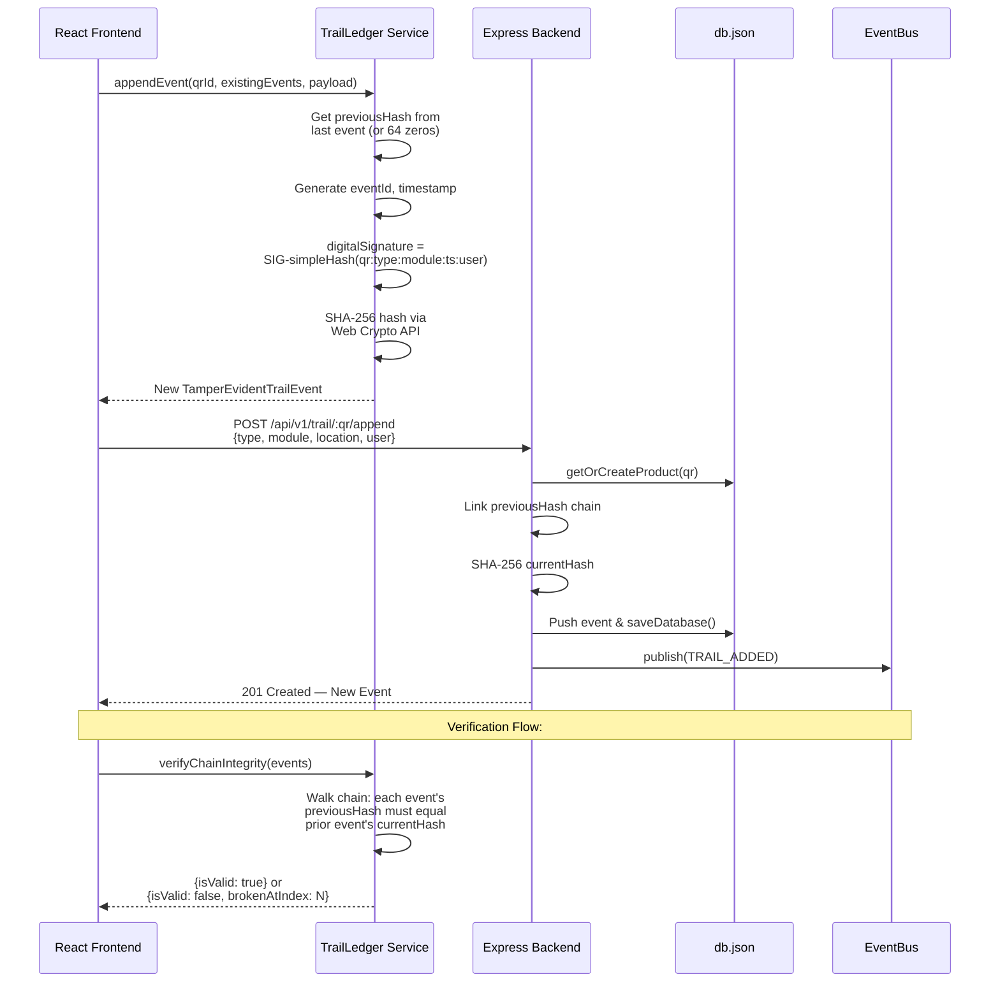
```mermaid
sequenceDiagram
    participant FE as React Frontend
    participant Ledger as TrailLedger Service
    participant API as Express Backend
    participant DB as db.json
    participant Bus as EventBus

    FE->>Ledger: appendEvent(qrId, existingEvents, payload)
    Ledger->>Ledger: Get previousHash from<br/>last event (or 64 zeros)
    Ledger->>Ledger: Generate eventId, timestamp
    Ledger->>Ledger: digitalSignature =<br/>SIG-simpleHash(qr:type:module:ts:user)
    Ledger->>Ledger: SHA-256 hash via<br/>Web Crypto API
    Ledger-->>FE: New TamperEvidentTrailEvent

    FE->>API: POST /api/v1/trail/:qr/append<br/>{type, module, location, user}
    API->>DB: getOrCreateProduct(qr)
    API->>API: Link previousHash chain
    API->>API: SHA-256 currentHash
    API->>DB: Push event & saveDatabase()
    API->>Bus: publish(TRAIL_ADDED)
    API-->>FE: 201 Created — New Event

    Note over FE,Bus: Verification Flow:
    FE->>Ledger: verifyChainIntegrity(events)
    Ledger->>Ledger: Walk chain: each event's<br/>previousHash must equal<br/>prior event's currentHash
    Ledger-->>FE: {isValid: true} or<br/>{isValid: false, brokenAtIndex: N}
```

---

## 6. Entity-Relationship Diagrams (ERD)

### 6.1 — Core Platform Data Model

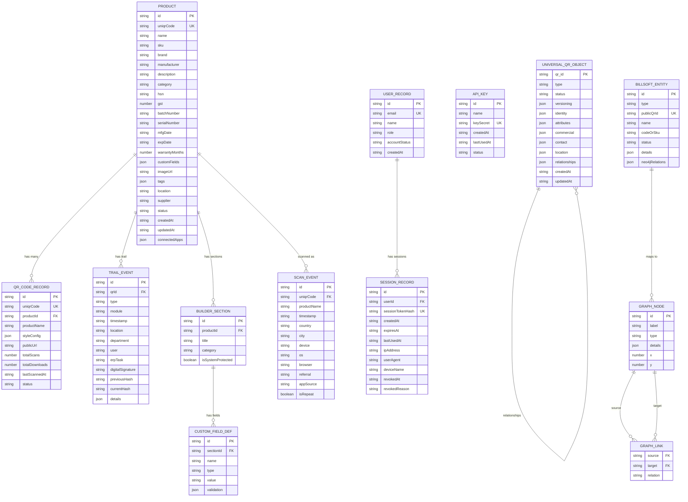
```mermaid
erDiagram
    PRODUCT {
        string id PK
        string uniqrCode UK
        string name
        string sku
        string brand
        string manufacturer
        string description
        string category
        string hsn
        number gst
        string batchNumber
        string serialNumber
        string mfgDate
        string expDate
        number warrantyMonths
        json customFields
        string imageUrl
        json tags
        string location
        string supplier
        string status
        string createdAt
        string updatedAt
        json connectedApps
    }

    QR_CODE_RECORD {
        string id PK
        string uniqrCode UK
        string productId FK
        string productName
        json styleConfig
        string publicUrl
        number totalScans
        number totalDownloads
        string lastScannedAt
        string status
    }

    TRAIL_EVENT {
        string id PK
        string qrId FK
        string type
        string module
        string timestamp
        string location
        string department
        string user
        string erpTask
        string digitalSignature
        string previousHash
        string currentHash
        json details
    }

    BUILDER_SECTION {
        string id PK
        string productId FK
        string title
        string category
        boolean isSystemProtected
    }

    CUSTOM_FIELD_DEF {
        string id PK
        string sectionId FK
        string name
        string type
        string value
        json validation
    }

    USER_RECORD {
        string id PK
        string email UK
        string name
        string role
        string accountStatus
        string createdAt
    }

    SESSION_RECORD {
        string id PK
        string userId FK
        string sessionTokenHash UK
        string createdAt
        string expiresAt
        string lastUsedAt
        string ipAddress
        string userAgent
        string deviceName
        string revokedAt
        string revokedReason
    }

    SCAN_EVENT {
        string id PK
        string uniqrCode FK
        string productName
        string timestamp
        string country
        string city
        string device
        string os
        string browser
        string referral
        string appSource
        boolean isRepeat
    }

    GRAPH_NODE {
        string id PK
        string label
        string type
        json details
        number x
        number y
    }

    GRAPH_LINK {
        string source FK
        string target FK
        string relation
    }

    API_KEY {
        string id PK
        string name
        string keySecret UK
        string createdAt
        string lastUsedAt
        string status
    }

    UNIVERSAL_QR_OBJECT {
        string qr_id PK
        string type
        string status
        json versioning
        json identity
        json attributes
        json commercial
        json contact
        json location
        json relationships
        string createdAt
        string updatedAt
    }

    BILLSOFT_ENTITY {
        string id PK
        string type
        string publicQrId UK
        string name
        string codeOrSku
        string status
        json details
        json neo4jRelations
    }

    PRODUCT ||--o{ QR_CODE_RECORD : "has many"
    PRODUCT ||--o{ TRAIL_EVENT : "has trail"
    PRODUCT ||--o{ BUILDER_SECTION : "has sections"
    PRODUCT ||--o{ SCAN_EVENT : "scanned as"
    BUILDER_SECTION ||--o{ CUSTOM_FIELD_DEF : "has fields"
    USER_RECORD ||--o{ SESSION_RECORD : "has sessions"
    GRAPH_NODE ||--o{ GRAPH_LINK : "source"
    GRAPH_NODE ||--o{ GRAPH_LINK : "target"
    UNIVERSAL_QR_OBJECT ||--o{ UNIVERSAL_QR_OBJECT : "relationships"
    BILLSOFT_ENTITY ||--o{ GRAPH_NODE : "maps to"
```

---

### 6.2 — BillSoft Integration Entity Map

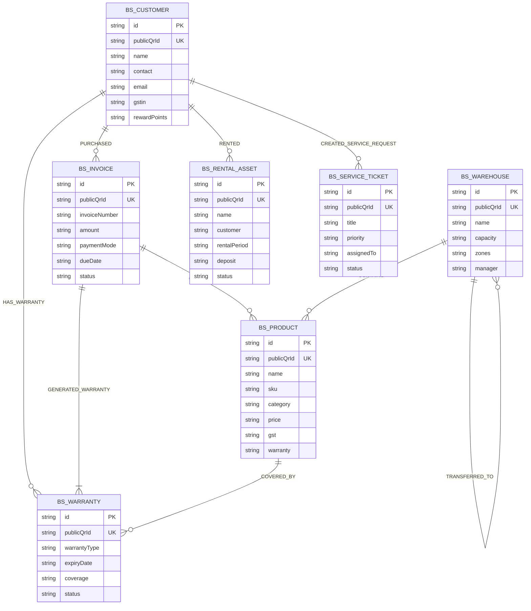
```mermaid
erDiagram
    BS_PRODUCT {
        string id PK
        string publicQrId UK
        string name
        string sku
        string category
        string price
        string gst
        string warranty
    }

    BS_CUSTOMER {
        string id PK
        string publicQrId UK
        string name
        string contact
        string email
        string gstin
        string rewardPoints
    }

    BS_INVOICE {
        string id PK
        string publicQrId UK
        string invoiceNumber
        string amount
        string paymentMode
        string dueDate
        string status
    }

    BS_WAREHOUSE {
        string id PK
        string publicQrId UK
        string name
        string capacity
        string zones
        string manager
    }

    BS_RENTAL_ASSET {
        string id PK
        string publicQrId UK
        string name
        string customer
        string rentalPeriod
        string deposit
        string status
    }

    BS_WARRANTY {
        string id PK
        string publicQrId UK
        string warrantyType
        string expiryDate
        string coverage
        string status
    }

    BS_SERVICE_TICKET {
        string id PK
        string publicQrId UK
        string title
        string priority
        string assignedTo
        string status
    }

    BS_CUSTOMER ||--o{ BS_INVOICE : "PURCHASED"
    BS_CUSTOMER ||--o{ BS_RENTAL_ASSET : "RENTED"
    BS_CUSTOMER ||--o{ BS_WARRANTY : "HAS_WARRANTY"
    BS_CUSTOMER ||--o{ BS_SERVICE_TICKET : "CREATED_SERVICE_REQUEST"
    BS_INVOICE ||--o{ BS_PRODUCT : "CONTAINS"
    BS_INVOICE ||--|{ BS_WARRANTY : "GENERATED_WARRANTY"
    BS_WAREHOUSE ||--o{ BS_PRODUCT : "CONTAINS"
    BS_WAREHOUSE ||--o{ BS_WAREHOUSE : "TRANSFERRED_TO"
    BS_PRODUCT ||--o{ BS_WARRANTY : "COVERED_BY"
```

---

## 7. Component & Deployment Diagrams

### 7.1 — Software Component Architecture

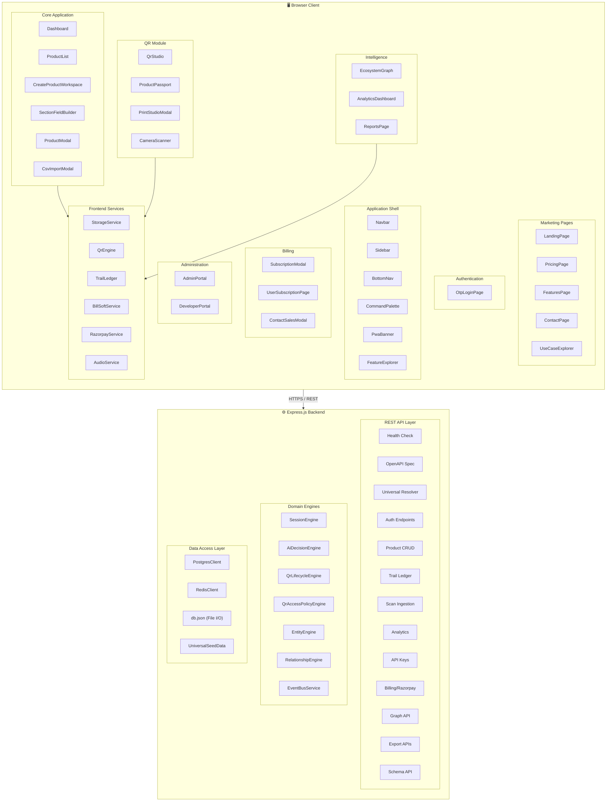
```mermaid
flowchart TB
    subgraph Client["🖥️ Browser Client"]
        direction TB
        subgraph Marketing["Marketing Pages"]
            LP["LandingPage"]
            PP["PricingPage"]
            FP["FeaturesPage"]
            CP["ContactPage"]
            UCE["UseCaseExplorer"]
        end

        subgraph Auth["Authentication"]
            OTP["OtpLoginPage"]
        end

        subgraph AppShell["Application Shell"]
            NAV["Navbar"]
            SB["Sidebar"]
            BN["BottomNav"]
            CMD["CommandPalette"]
            PWA["PwaBanner"]
            FX["FeatureExplorer"]
        end

        subgraph CoreApp["Core Application"]
            DASH["Dashboard"]
            PROD["ProductList"]
            CPW["CreateProductWorkspace"]
            SFB["SectionFieldBuilder"]
            PM["ProductModal"]
            CSV["CsvImportModal"]
        end

        subgraph QRModule["QR Module"]
            QRS["QrStudio"]
            PPS["ProductPassport"]
            PSM["PrintStudioModal"]
            CAM["CameraScanner"]
        end

        subgraph Intelligence["Intelligence"]
            GRP["EcosystemGraph"]
            ANA["AnalyticsDashboard"]
            RPT["ReportsPage"]
        end

        subgraph Billing["Billing"]
            SUB["SubscriptionModal"]
            USP["UserSubscriptionPage"]
            CSM["ContactSalesModal"]
        end

        subgraph Admin["Administration"]
            ADM["AdminPortal"]
            DEV["DeveloperPortal"]
        end

        subgraph Services["Frontend Services"]
            STG["StorageService"]
            QRE["QrEngine"]
            TRL["TrailLedger"]
            BSS["BillSoftService"]
            RZP["RazorpayService"]
            AUD["AudioService"]
        end
    end

    subgraph Server["⚙️ Express.js Backend"]
        direction TB
        subgraph API_Layer["REST API Layer"]
            HL["Health Check"]
            OA["OpenAPI Spec"]
            UNI["Universal Resolver"]
            AUTH_API["Auth Endpoints"]
            PROD_API["Product CRUD"]
            TRAIL_API["Trail Ledger"]
            SCAN_API["Scan Ingestion"]
            ANA_API["Analytics"]
            KEY_API["API Keys"]
            BILL_API["Billing/Razorpay"]
            GRAPH_API["Graph API"]
            EXPORT["Export APIs"]
            SCHEMA["Schema API"]
        end

        subgraph Domain_Engines["Domain Engines"]
            SE["SessionEngine"]
            ADE["AiDecisionEngine"]
            QLE["QrLifecycleEngine"]
            QAP["QrAccessPolicyEngine"]
            EE["EntityEngine"]
            RE["RelationshipEngine"]
            EB["EventBusService"]
        end

        subgraph Data_Layer["Data Access Layer"]
            PGC["PostgresClient"]
            RC["RedisClient"]
            JSONDB["db.json (File I/O)"]
            SEED["UniversalSeedData"]
        end
    end

    Client -- "HTTPS / REST" --> Server
    CoreApp --> Services
    QRModule --> Services
    Intelligence --> Services
```

---

### 7.2 — Physical Deployment Diagram

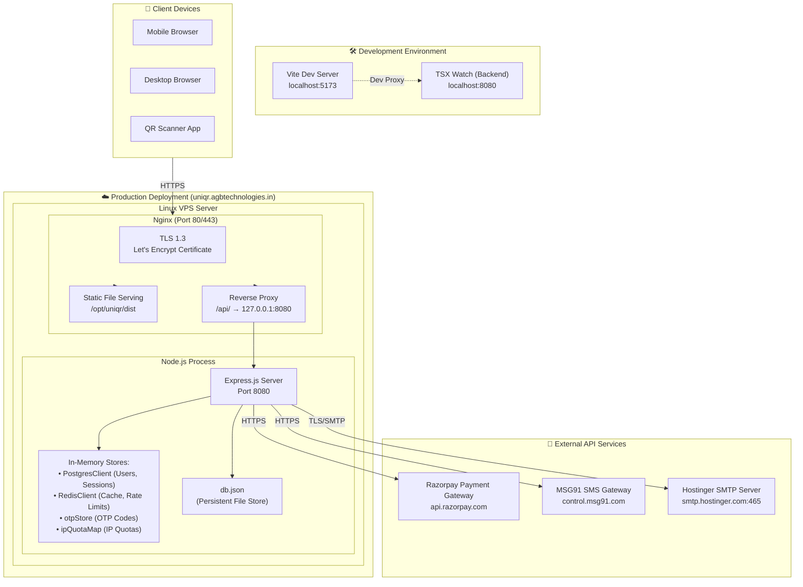
```mermaid
flowchart TB
    subgraph Cloud["☁️ Production Deployment (uniqr.agbtechnologies.in)"]
        subgraph VPS["Linux VPS Server"]
            subgraph Nginx["Nginx (Port 80/443)"]
                SSL["TLS 1.3<br/>Let's Encrypt Certificate"]
                STATIC["Static File Serving<br/>/opt/uniqr/dist"]
                PROXY["Reverse Proxy<br/>/api/ → 127.0.0.1:8080"]
            end

            subgraph NodeProcess["Node.js Process"]
                EXPRESS["Express.js Server<br/>Port 8080"]
                MEMORY["In-Memory Stores:<br/>• PostgresClient (Users, Sessions)<br/>• RedisClient (Cache, Rate Limits)<br/>• otpStore (OTP Codes)<br/>• ipQuotaMap (IP Quotas)"]
                FILEDB["db.json<br/>(Persistent File Store)"]
            end
        end
    end

    subgraph ExternalAPIs["🔌 External API Services"]
        RZP["Razorpay Payment Gateway<br/>api.razorpay.com"]
        MSG91["MSG91 SMS Gateway<br/>control.msg91.com"]
        SMTP["Hostinger SMTP Server<br/>smtp.hostinger.com:465"]
    end

    subgraph DevEnv["🛠️ Development Environment"]
        VITE["Vite Dev Server<br/>localhost:5173"]
        TSX["TSX Watch (Backend)<br/>localhost:8080"]
    end

    subgraph ClientDevices["📱 Client Devices"]
        MOBILE["Mobile Browser"]
        DESKTOP["Desktop Browser"]
        SCANNER["QR Scanner App"]
    end

    ClientDevices -- "HTTPS" --> Nginx
    Nginx --> STATIC
    Nginx --> PROXY
    PROXY --> EXPRESS
    EXPRESS --> MEMORY
    EXPRESS --> FILEDB
    EXPRESS -- "HTTPS" --> RZP
    EXPRESS -- "HTTPS" --> MSG91
    EXPRESS -- "TLS/SMTP" --> SMTP

    VITE -. "Dev Proxy" .-> TSX
```

---

### 7.3 — Frontend Component Dependency Tree

```mermaid
flowchart TD
    APP["App.tsx<br/>(Root Component)"]

    APP --> NAV["Navbar"]
    APP --> SB["Sidebar"]
    APP --> BN["BottomNav"]
    APP --> PWA["PwaBanner"]
    APP --> CMD["CommandPalette"]
    APP --> FX["FeatureExplorer"]

    APP --> LP["LandingPage"]
    APP --> PP["PricingPage"]
    APP --> FP["FeaturesPage"]
    APP --> CP["ContactPage"]
    APP --> UCE["UseCaseExplorer"]

    APP --> OTP["OtpLoginPage"]

    APP --> DASH["Dashboard"]
    APP --> PL["ProductList"]
    APP --> CPW["CreateProductWorkspace"]
    APP --> PM["ProductModal"]
    APP --> CSV["CsvImportModal"]

    APP --> QRS["QrStudio"]
    APP --> PPS["ProductPassport"]
    APP --> CAM["CameraScanner"]

    APP --> GRP["EcosystemGraph"]
    APP --> ANA["AnalyticsDashboard"]
    APP --> RPT["ReportsPage"]

    APP --> SUB["SubscriptionModal"]
    APP --> USP["UserSubscriptionPage"]
    APP --> CSM["ContactSalesModal"]

    APP --> ADM["AdminPortal"]
    APP --> DEV["DeveloperPortal"]

    CPW --> SFB["SectionFieldBuilder"]
    QRS --> PSM["PrintStudioModal"]

    subgraph SharedServices["Shared Services Layer"]
        STG["storage.ts"]
        QRE["qrEngine.ts"]
        TRL["trailLedger.ts"]
        BSS["billsoftService.ts"]
        RZP["razorpay.ts"]
        AUD["audio.ts"]
    end

    PL & CPW & DASH --> STG
    QRS --> QRE
    CPW --> TRL
    DEV --> BSS
    SUB & USP --> RZP
    APP --> AUD

    style APP fill:#1D4533,color:#F7EAE0,stroke:#F9D2BA,stroke-width:2px
```

---

## 8. Agile / Iterative Spirals

### 8.1 — UniQR Development Sprint Cycle

```mermaid
flowchart TD
    subgraph Sprint["🔄 Iterative Sprint Cycle"]
        direction TB
        P["📋 PLAN<br/>Define user stories,<br/>scope features,<br/>set sprint goals"]
        D["🛠️ DEVELOP<br/>Build components,<br/>implement APIs,<br/>write domain engines"]
        T["🧪 TEST<br/>Verify hash chains,<br/>test auth flows,<br/>validate payments"]
        R["🚀 RELEASE<br/>Build frontend dist,<br/>deploy to VPS,<br/>nginx restart"]
        F["📊 FEEDBACK<br/>Scan analytics,<br/>event bus monitoring,<br/>user sessions review"]
    end

    P --> D --> T --> R --> F --> P

    style P fill:#1D4533,color:#F7EAE0
    style D fill:#2A5A3F,color:#F7EAE0
    style T fill:#3D6F54,color:#F7EAE0
    style R fill:#508569,color:#F7EAE0
    style F fill:#639B7E,color:#F7EAE0
```

---

### 8.2 — Feature Delivery Spiral Model

```mermaid
flowchart TD
    subgraph Spiral1["🌀 Spiral 1: Core Identity"]
        S1A["Product Data Model<br/>CRUD APIs"] --> S1B["QR Code Generation<br/>Canvas Engine"] --> S1C["Product Passport<br/>Public Page"] --> S1D["db.json Persistence"]
    end

    subgraph Spiral2["🌀 Spiral 2: Security"]
        S2A["OTP Authentication<br/>Email + SMS"] --> S2B["HttpOnly Cookie Sessions<br/>Session Rotation"] --> S2C["Rate Limiting<br/>(Sliding Window)"] --> S2D["QR Access Policy Engine"]
    end

    subgraph Spiral3["🌀 Spiral 3: Intelligence"]
        S3A["Event Bus Architecture<br/>(Pub/Sub)"] --> S3B["AI Decision Engine<br/>Predictive Maintenance"] --> S3C["Fraud Detection<br/>(Impossible Travel)"] --> S3D["Ecosystem Graph<br/>Neo4j-style"]
    end

    subgraph Spiral4["🌀 Spiral 4: Monetization"]
        S4A["Subscription Tiers<br/>6 Plans"] --> S4B["Razorpay Integration<br/>Order + Verify"] --> S4C["IP-Level Quota<br/>Free Tier Limits"] --> S4D["Enterprise API Keys"]
    end

    subgraph Spiral5["🌀 Spiral 5: Enterprise"]
        S5A["Tamper-Evident<br/>SHA-256 Trail Ledger"] --> S5B["BillSoft ERP<br/>Integration (11 Entities)"] --> S5C["Bulk CSV Import<br/>+ Batch Operations"] --> S5D["Universal QR<br/>Seed Data Engine<br/>(16 Entity Types)"]
    end

    Spiral1 --> Spiral2 --> Spiral3 --> Spiral4 --> Spiral5

    style S1A fill:#1D4533,color:#F7EAE0
    style S2A fill:#1D4533,color:#F7EAE0
    style S3A fill:#1D4533,color:#F7EAE0
    style S4A fill:#1D4533,color:#F7EAE0
    style S5A fill:#1D4533,color:#F7EAE0
```

---

### 8.3 — Continuous Feedback & Event-Driven Loop

```mermaid
flowchart LR
    subgraph Observe["👁️ OBSERVE"]
        OB1["Scan Events (POST /scans)"]
        OB2["EventBus History"]
        OB3["Session Activity Logs"]
        OB4["Rate Limit Violations"]
    end

    subgraph Orient["🧭 ORIENT"]
        OR1["Analytics Summary API"]
        OR2["AI Risk Score Calculation"]
        OR3["Fraud Detection Triggers"]
        OR4["Chain Integrity Checks"]
    end

    subgraph Decide["🎯 DECIDE"]
        DE1["Persona-Aware<br/>Response Selection"]
        DE2["Predictive Maintenance<br/>Scheduling"]
        DE3["Policy Matrix<br/>Evaluation"]
        DE4["Version Upgrade<br/>Decision"]
    end

    subgraph Act["⚡ ACT"]
        AC1["Publish System Events"]
        AC2["Update QR State"]
        AC3["Trigger Notifications"]
        AC4["Rotate Sessions"]
    end

    Observe --> Orient --> Decide --> Act --> Observe
```

---

### 8.4 — API Endpoint Evolution Timeline

| Sprint | Endpoints Added | Domain |
|--------|----------------|--------|
| **Sprint 1** | `/api/v1/health`, `/api/v1/products` (CRUD) | Core |
| **Sprint 2** | `/api/v1/details/:qr`, `/api/v1/trail/:qr` | Identity |
| **Sprint 3** | `/api/v1/auth/send-otp`, `/api/v1/auth/verify-otp` | Auth |
| **Sprint 4** | `/api/v1/auth/login`, `/api/v1/auth/logout`, `/api/v1/auth/me` | Session |
| **Sprint 5** | `/api/v1/auth/sessions`, `/api/v1/auth/sessions/:id` | Device Mgmt |
| **Sprint 6** | `/api/v1/q/:token`, `/api/v1/ai/predictive/:id` | AI Gateway |
| **Sprint 7** | `/api/v1/scans`, `/api/v1/analytics/summary` | Analytics |
| **Sprint 8** | `/api/v1/keys` (CRUD), `/api/v1/ip-quota` | Developer |
| **Sprint 9** | `/api/v1/billing/create-order`, `/api/v1/billing/verify-payment` | Payments |
| **Sprint 10** | `/api/v1/universal`, `/api/v1/resolve/:qr` | Universal QR |
| **Sprint 11** | `/api/v1/export/highres/:qr`, `/api/v1/export/vector/:qr` | Export |
| **Sprint 12** | `/api/v1/products/:qr/schema`, `/api/v1/openapi.json` | Developer API |
| **Sprint 13** | `/api/v1/products/bulk` (POST/DELETE), `/api/v1/events` | Enterprise |
| **Sprint 14** | `/api/v1/auth/deactivate`, `/api/v1/trail/:qr/append` | Compliance |
| **Sprint 15** | `/api/v1/graph` | Intelligence |

---

## Summary Statistics

| Metric | Count |
|--------|-------|
| **Total REST API Endpoints** | 30+ |
| **Backend Domain Engines** | 7 |
| **Frontend Components** | 28 |
| **Frontend Services** | 9 |
| **TypeScript Interfaces** | 18+ |
| **Event Types** | 11 |
| **QR Lifecycle States** | 10 |
| **Visibility Policies** | 6 |
| **Universal Entity Types** | 16 |
| **BillSoft Entity Types** | 11 |
| **External Integrations** | 3 (Razorpay, MSG91, Hostinger SMTP) |

---

> [!TIP]
> All diagrams in this document are rendered as **Mermaid** and can be exported to PNG/SVG using any Mermaid-compatible tool. They map 1:1 to the actual codebase structure at time of analysis.
